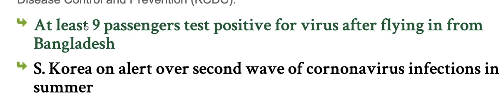

# Cascading Style Sheets
1. definition  
   >__Sytle sheet language with the HTML, that tells browser *how does a website should looks* like.__

   ¡Ø HTML is a content that tells browser **`what`** to display  
    

2. What does it do?
   - if somebody hovers up the link, it should be green, else black
   - html has the information "a-tag" href to another link. CSS has information to what colors to switch, what fonts used and ect...
   