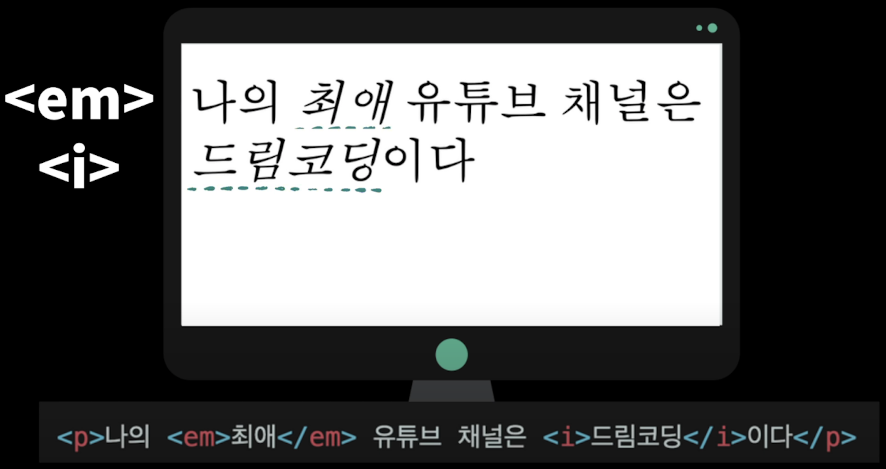

<link href="../md_config/style.css" rel="stylesheet">

# Semantic Tags

[참조 링크](https://www.youtube.com/watch?v=T7h8O7dpJIg)

## 1) What is Semantic Tags?

- 의미가 있는 mark-up
- 한눈에 봐도 의미를 알 수 있는 tag(역할이 정해져 있는 약속에 가까움)

<br>

## 2) Advantages of using Semantic Tags


- Accessibility : For Speech, keyboard only website

<br>

## 3) Semantic Tags Heirarchy


<br>

- HTML CSS JS 로 이루어진 기본 웹 / 프레임워크(React, Vue, Angular) 등을 쓰더라도, Semantic 태그는 지키는 것이 좋음!

<br>

## 4) Article VS Section

<br>

- Article

  
  

  - Article은 블로그 / 신문 기사자체 등에서 그 자체로 1개의 완성형으로 묶어줄 수 있을 때(독립적으로 보여줄 수 있을 때) 만족
  - Main의 다른 정보들과 상관 없이 보여줄 수 있을 때

<br>

- Section

  

  - Main / article 태그 안에서 어디서나 사용되는데
  - 주로 연관성 있는 정보를 묶어주려고 할 때 사용
  - 한 Main 페이지 안에 여러가지 정보를 보여주려고 할 때 주로 섹션으로 나누어서 보여주도록 함  
    (센션별로 블로그 article post를 보여주는 경우)

<br>

## 5) em VS i Tags



- i tag

  - 시각적으로만 italic 체로 변경
  - 별다른 의미부여 없음

- em
  - 실제로 문장에서 강조하는 이텔릭체가 필요한 경우
  - 시각정보 말고 "강조"되는 것이 다른 곳에서 사용되는 정보인 경우에 em

<br>

## 6) b VS strong


- b Tags

  - 시각적으로만 bold 체

- strong
  - 실제로 문장에서 강조하는 볼드 체가 필요한 경우
  - 시각정보 말고 "강조"되는 것이 다른 곳에서 사용되는 정보인 경우에 strong

<br>

## 7) ol VS ul VS dl

- ul

  

  - 순서가 필요없는 item들을 단순히 나열해야 할 때 사용
  - 중첩할 수도 있음

- ol

  - 순서가 중요한 item 경우에 사용

- dl

  - 정의, 설명을 하고싶을 때 사용

  

  - dt : Description Term; 원하는 단어
  - dd : Description Detail; 해당하는 세부 설명 작성
  - dl : Description List; 시작 끝 태그

<br>

## 8) img VS \[CSS]background-image


- img Tag
  - image 웹페이지 안에서 단독으로 중요할 때 사용
- background-image
  - 스타일링 목적으로만 사용될 때
  - 문서의 일부분에 단독으로 사용되는 경우가 아닐 때
  - (= 없어도 문서의 content를 이해하는데 지장이 없고, 오로지 꾸미는 용도)

<br>

## 9) button VS a

- 둘다 CSS로 스타일링을 해놓으면 버튼처럼 보이기는 하기 때문에, 헷갈림
- a Tag

  

  - 어디론가 이동해야하는 link로써의 기능, anchor tag

<br>

- button Tag

  

  - review, login, sign-in, quiz 등 사용자의 특정 액션이 필요 -> button
  - form tag로 감싸진 input 과 같이 사용가능
  - Example
    - HTML
      ```HTML
        <form action="/examples/media/action_target.php" method="get" id="loginForm">
            이름 : <input type="text" name="st_name"><br>
            학번 : <input type="text" name="stt_d"><br>
            학과 : <input type="text" name="department"><br><br>
        </form>
        <button type="submit" form="loginForm">제출하기</button>
      ```

## 10) table VS CSS

- Table

  

  - 행 + 열 의 item이 매우 많은 경우
  - 문서 안에서 자체적으로 의미있는 table 태그가 필요한 경우

- CSS
  - item을 단순히 테이블 형태로 표현하는 경우
  - 요즘은 CSS가 많이 발전해서 이 방식을 많이 쓰기도 함
  - Flex, Grid 로 많이 사용
