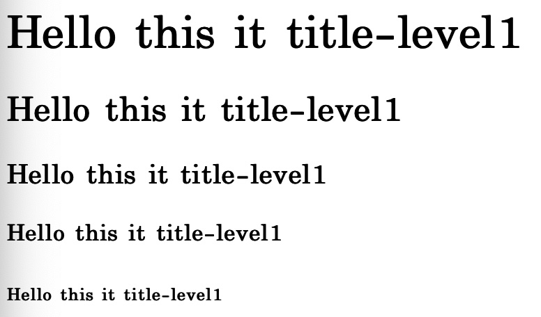
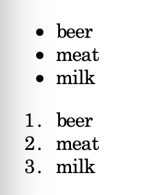
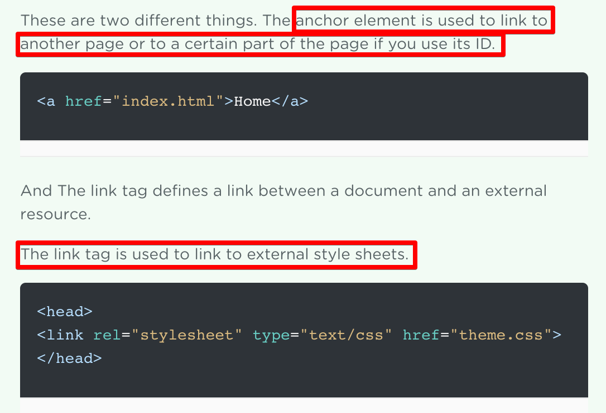

# 1. Things to remember

1. Something will show up if you type in the HTMl.
2. Browser will show even if with the errors exsting in the file.
   Means, browser will always show you the contents.  
   Therefore, always `becareful for the errors`.
3. Tag starts with "< >" and ends with "</ >"
4. Any tags can be made but ceratin tags have certain uses.

<br></br>

# 2. Special Tags

## 1) h tag

- this is header tag, 1st level
- h will exist from 1 ~ 6 levels
  

<br></br>

## 2) list tags



### a) ul tags

makes an un-ordered list, need \<li>\</li> tags inside

### b) or tags

makes an ordered list, need \<li>\</li> tags inside

<br></br>

## 3) anchor tag

what ever put inside the \<a>\</a>tag will redirect you to a another url/uri
needs additional information in the **`attribute`**

> ### a) href
>
> href is short for HTTP reference OR hyper link reference
>
> ```html
> <a href="link to the page you want"></a>
> ```
>
> ### b) attributes of anchor tag
>
> href : It will take you to the written location
> target : Default is \_self  
>  \_blank is to open a new tab and go to the link from there
>
> ```html
> <a href="link to the page you want" taget="_self"></a>
> ```

- Difference with "link" tag
  

<br></br>

## 4) image tag

To append a image, \ should be used.
Because image is an image, it **`doesnt have a content`** between the tags.
So it is written in the **`self closing tag`** form.

```html

```

# 3. Attributes

You can set a attribute in the tag.
Anything can be written, however **`only certain tags with certain attributes`** will be inperted by the Browser.
