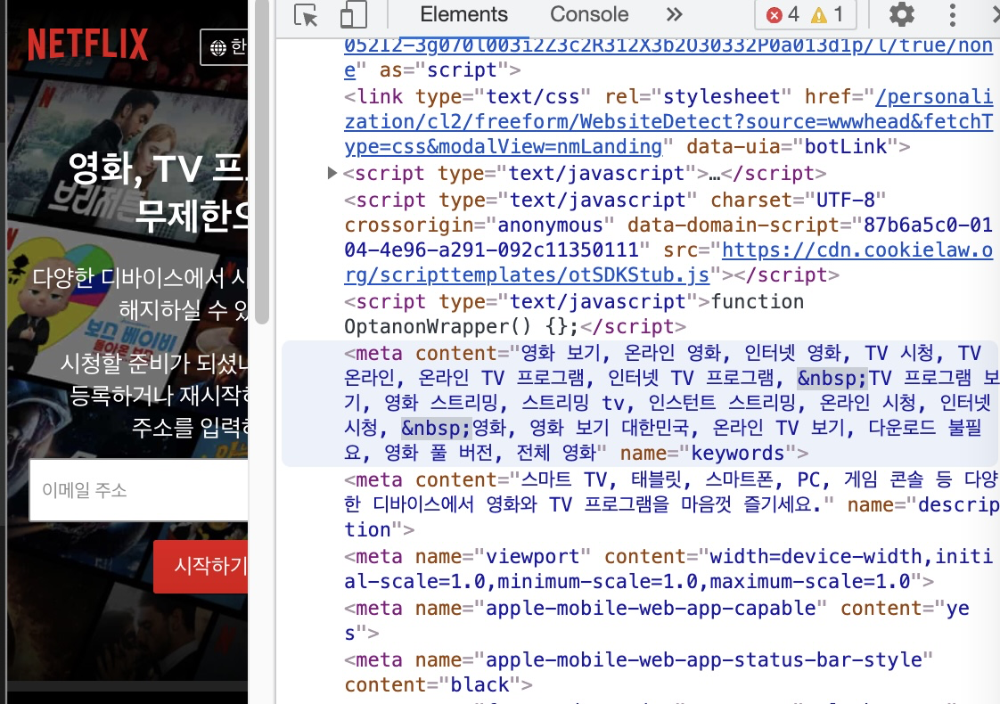
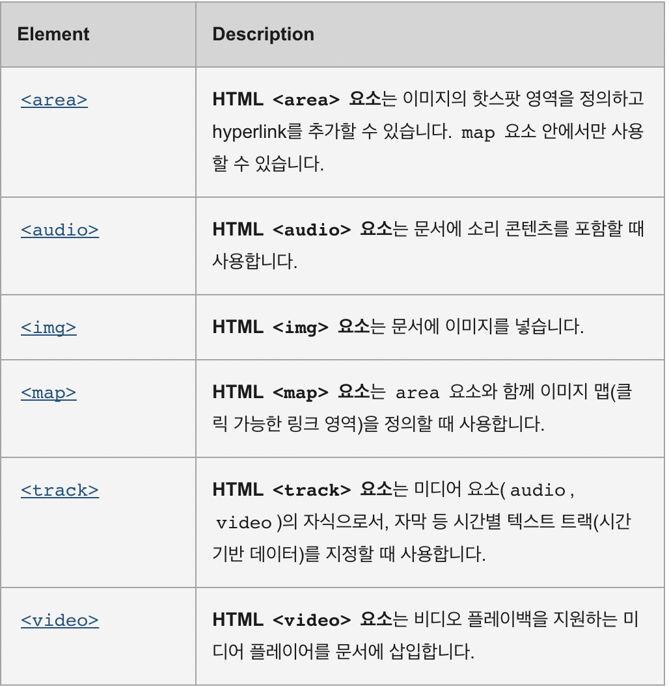
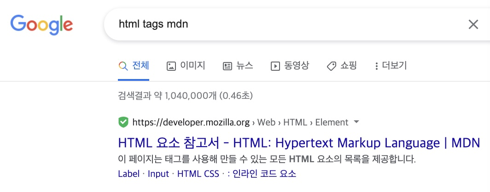

# HTML
## 1. HTML shape
### a) Doctype
- HTML should always start with `\<!DOCTYPE html>`  
- Affects of this
  - This allows the browser to know it is a HTML document, not a text
  - This allows the brwoser you are using HTML

<br>

### b) HTML
- \<html> \</html> tag should be followed after Doctype
- This will be at the most front and end of the tags.
- You can also define language options.
  This option will help search engines to know what language is the website is using.
  ```HTML
   <html lang="ko">
      ...
   </html>
  ```

<br>

### c) head
- <span style='color:orange'>**Sets the setting and configuration for our HTML web page.**</span>
- Plain texts inside head tag will not be visible. But will cause error when CSS JS integrated.
- Settngs options  
  1) Title
  
  Title will be the thing that search engines will look up and index.  
  Also can be shown in the tab.
  
  <br>
  
  2) Meta-data
  
  - Simply means datas of data. Additional information.
  - Some metadata can also be displayed as description in the search engine.
  - Type of meta tags that can be used
     > 1) name
     > 2) content
     > 3) link : can be placed in the head tag.
     > 
     > This adds a icon in the tab content.
     > 4) property og:XXX
     > These will show if you share you website to a sns.
     > ```HTML
     >   <meta property="og:title" content="Nomad Coders">
     >   <meta property="og:type" content="website">
     > ```
     > 5) `description` : ``very important!``
     > 6) charset : for encoding, tells browser how to draw the text. (when using Korean or other languaes...)  
     >  `Always put this tag'
     >  ```HTML
     >    <meta charset='utf-8'\>
     >    <link 
     >     rel="shorcut icon" sizes="16X16 32X32 64X64" href="https://nomadcoders.co/m.png"
     >    />
     >  ```

### d) body
- Anything you actually want to show, contents, should be placed under body tag.  
   \<body>&nbsp;\</body>

- Types of tags that can be used in body
   1) \<p> \</p>  
      This can be used to display long texts.
      Means paragraph.
   2) \<ol> \</ol> OR \<ul> \</ul> with \<li> as sub tag.
   3) \<pre> \</pre>
      This can be used if you want your font to look like a typewriter.
   4) \<a> \</a>
      Anchor tag with attributes, acts as a link to another page.
   5) \<abbr> \</abbr>
      This will show a dotted underline with the text. Can be used for abbreviation.
      
      Information will show what title attribute has.
      ``` html
         <abbr title="Cascading Style Sheet">CSS</abbr>
      ```
   6) \<mark> \</mark>
      This will mark the capsulated content.
      
      ```HTML
         <p>I like to live in <mark>South Korea</mark></p>
      ```
   7) \<sub> \</sub>
      This makes the text go bit under the normal position.
   8) \<sup> \</sup>
      This makes the text go bit over the noraml position.
   9)  \<strong> \</strong>
      This makes a bold text.
   10) **`Multi media`**
   
   ```HTML
      Example
      <audio
         controls='enabled'
         autoplay='enabled'
         src='Source to the mp3 file'
      ></audio>

      This will also have the same effect
      <audio
         controls
         autoplay
         src='Source to the mp3 file'
      ></audio>
   ```


<br>

### e) HTML tag search - MDN
- [Link for MDN - HTML site](https://developer.mozilla.org/ko/docs/Web/HTML/Element)
- Always search for MDN results.

- Never use w3school search results.