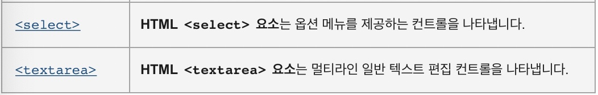
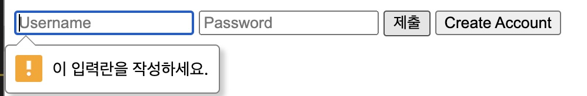
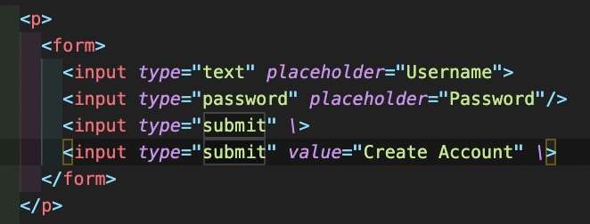
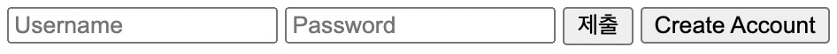

# Form tags
- Will be made only with the HTML.
- Learn power of the tags and attributes!
- Is used when **`Some inputs should be put into the webpage`**



## 1) Form
- It is used for wrapping the other form-related tags.
- Used to hand the information to the server.
  ```HTML
   Input is a self-closing tag.
   <form>
      <input \>
   </form>
  ```

<br>

## 2) input
- Can be used in many ways if you add type attribute.
- Will allow all kinds of inputs that user can place with in the webpage

<div><p><code>&lt;input&gt;</code> 요소의 동작 방식은 <a href="/ko/docs/Web/HTML/Global_attributes#attr-type"><code>type</code></a> 특성에 따라 현격히 달라지므로, 각각의 유형은 별도의 참고 문서에서 더 자세히 확인할 수 있습니다. 특성을 지정하지 않은 경우, 기본값은 <code>text</code>입니다.</p>
<p>가능한 유형은 다음과 같습니다.</p>
<table class="standard-table">
 <colgroup>
  <col>
  <col style="width: 50%;">
  <col>
 </colgroup>
 <thead>
  <tr>
   <th>유형</th>
   <th>설명</th>
   <th>기본 예제</th>
   <th>Spec</th>
  </tr>
 </thead>
 <tbody>
  <tr>
   <td><a href="/ko/docs/Web/HTML/Element/Input/button">button</a></td>
   <td>기본 행동을 가지지 않으며 <a href="/ko/docs/Web/HTML/Element/Input#attr-value" aria-current="page"><code>value</code></a>을 레이블로 사용하는 푸시 버튼.</td>
   <td id="examplebutton">
    <div class="code-example"><pre class="brush: html hidden notranslate"><code><span class="token tag"><span class="token tag"><span class="token punctuation">&lt;</span>input</span>  <span class="token attr-name">type</span><span class="token attr-value"><span class="token punctuation attr-equals">=</span><span class="token punctuation">"</span>button<span class="token punctuation">"</span></span> <span class="token attr-name">name</span><span class="token attr-value"><span class="token punctuation attr-equals">=</span><span class="token punctuation">"</span>button<span class="token punctuation">"</span></span> <span class="token punctuation">/&gt;</span></span></code></pre></div>
    <iframe class="nobutton" title="examplebutton sample" id="frame_examplebutton" width="200" height="60" src="https://yari-demos.prod.mdn.mozit.cloud/ko/docs/Web/HTML/Element/Input/_sample_.examplebutton.html" loading="lazy"></iframe></td>
   <td></td>
  </tr>
  <tr>
   <td><a href="/en-US/docs/Web/HTML/Element/input/checkbox" class="only-in-en-us" title="Currently only available in English (US)">checkbox (en-US)</a></td>
   <td>단일 값을 선택하거나 선택 해제할 수 있는 체크박스.</td>
   <td id="examplecheckbox">
    <div class="code-example"><pre class="brush: html hidden notranslate"><code><span class="token tag"><span class="token tag"><span class="token punctuation">&lt;</span>input</span>  <span class="token attr-name">type</span><span class="token attr-value"><span class="token punctuation attr-equals">=</span><span class="token punctuation">"</span>checkbox<span class="token punctuation">"</span></span> <span class="token attr-name">name</span><span class="token attr-value"><span class="token punctuation attr-equals">=</span><span class="token punctuation">"</span>checkbox<span class="token punctuation">"</span></span><span class="token punctuation">/&gt;</span></span></code></pre></div>
    <iframe class="nobutton" title="examplecheckbox sample" id="frame_examplecheckbox" width="200" height="60" src="https://yari-demos.prod.mdn.mozit.cloud/ko/docs/Web/HTML/Element/Input/_sample_.examplecheckbox.html" loading="lazy"></iframe></td>
   <td></td>
  </tr>
  <tr>
   <td><a href="/en-US/docs/Web/HTML/Element/input/color" class="only-in-en-us" title="Currently only available in English (US)">color (en-US)</a></td>
   <td>색을 지정할 수 있는 컨트롤. 브라우저가 지원하는 경우, 활성화 시 색상 선택기를 열어줍니다.</td>
   <td id="examplecolor">
    <div class="code-example"><pre class="brush: html hidden notranslate"><code><span class="token tag"><span class="token tag"><span class="token punctuation">&lt;</span>input</span>  <span class="token attr-name">type</span><span class="token attr-value"><span class="token punctuation attr-equals">=</span><span class="token punctuation">"</span>color<span class="token punctuation">"</span></span> <span class="token attr-name">name</span><span class="token attr-value"><span class="token punctuation attr-equals">=</span><span class="token punctuation">"</span>color<span class="token punctuation">"</span></span><span class="token punctuation">/&gt;</span></span></code></pre></div>
    <iframe class="nobutton" title="examplecolor sample" id="frame_examplecolor" width="200" height="60" src="https://yari-demos.prod.mdn.mozit.cloud/ko/docs/Web/HTML/Element/Input/_sample_.examplecolor.html" loading="lazy"></iframe></td>
   <td><span class="badge inline html-version"><a href="/ko/docs/HTML/HTML5" class="page-not-created" title="This is a link to an unwritten page">HTML5</a></span></td>
  </tr>
  <tr>
   <td><a href="/ko/docs/Web/HTML/Element/Input/date">date</a></td>
   <td>날짜(연월일, 시간 없음)를 지정할 수 있는 컨트롤. 브라우저가 지원하는 경우, 활성화 시 날짜를 선택할 수 있는 달력 등을 열어줍니다.</td>
   <td id="exampledate">
    <div class="code-example"><pre class="brush: html hidden notranslate"><code><span class="token tag"><span class="token tag"><span class="token punctuation">&lt;</span>input</span>  <span class="token attr-name">type</span><span class="token attr-value"><span class="token punctuation attr-equals">=</span><span class="token punctuation">"</span>date<span class="token punctuation">"</span></span> <span class="token attr-name">name</span><span class="token attr-value"><span class="token punctuation attr-equals">=</span><span class="token punctuation">"</span>date<span class="token punctuation">"</span></span><span class="token punctuation">/&gt;</span></span></code></pre></div>
    <iframe class="nobutton" title="exampledate sample" id="frame_exampledate" width="200" height="60" src="https://yari-demos.prod.mdn.mozit.cloud/ko/docs/Web/HTML/Element/Input/_sample_.exampledate.html" loading="lazy"></iframe></td>
   <td><span class="badge inline html-version"><a href="/ko/docs/HTML/HTML5" class="page-not-created" title="This is a link to an unwritten page">HTML5</a></span></td>
  </tr>
  <tr>
   <td><a href="/en-US/docs/Web/HTML/Element/input/datetime-local" class="only-in-en-us" title="Currently only available in English (US)">datetime-local (en-US)</a></td>
   <td>날짜와 시간을 지정할 수 있는 컨트롤. 시간대는 지정할 수 없습니다. 브라우저가 지원하는 경우, 활성화 시 날짜를 선택할 수 있는 달력과, 시계 등을 열어줍니다.</td>
   <td id="exampledtl">
    <div class="code-example"><pre class="brush: html hidden notranslate"><code><span class="token tag"><span class="token tag"><span class="token punctuation">&lt;</span>input</span>  <span class="token attr-name">type</span><span class="token attr-value"><span class="token punctuation attr-equals">=</span><span class="token punctuation">"</span>datetime-local<span class="token punctuation">"</span></span> <span class="token attr-name">name</span><span class="token attr-value"><span class="token punctuation attr-equals">=</span><span class="token punctuation">"</span>datetime-local<span class="token punctuation">"</span></span><span class="token punctuation">/&gt;</span></span></code></pre></div>
    <iframe class="nobutton" title="exampledtl sample" id="frame_exampledtl" width="200" height="60" src="https://yari-demos.prod.mdn.mozit.cloud/ko/docs/Web/HTML/Element/Input/_sample_.exampledtl.html" loading="lazy"></iframe></td>
   <td><span class="badge inline html-version"><a href="/ko/docs/HTML/HTML5" class="page-not-created" title="This is a link to an unwritten page">HTML5</a></span></td>
  </tr>
  <tr>
   <td><a href="/en-US/docs/Web/HTML/Element/input/email" class="only-in-en-us" title="Currently only available in English (US)">email (en-US)</a></td>
   <td>이메일 주소를 편집할 수 있는 필드. 텍스트 입력 필드처럼 보이지만 유효성 검증 매개변수가 존재하며, 브라우저와 장치가 동적 키보드를 지원하는 경우 이메일에 적합한 키보드를 보여줍니다.</td>
   <td id="exampleemail">
    <div class="code-example"><pre class="brush: html hidden notranslate"><code><span class="token tag"><span class="token tag"><span class="token punctuation">&lt;</span>input</span> <span class="token attr-name">type</span><span class="token attr-value"><span class="token punctuation attr-equals">=</span><span class="token punctuation">"</span>email<span class="token punctuation">"</span></span> <span class="token attr-name">name</span><span class="token attr-value"><span class="token punctuation attr-equals">=</span><span class="token punctuation">"</span>email<span class="token punctuation">"</span></span><span class="token punctuation">/&gt;</span></span></code></pre></div>
    <iframe class="nobutton" title="exampleemail sample" id="frame_exampleemail" width="200" height="60" src="https://yari-demos.prod.mdn.mozit.cloud/ko/docs/Web/HTML/Element/Input/_sample_.exampleemail.html" loading="lazy"></iframe></td>
   <td><span class="badge inline html-version"><a href="/ko/docs/HTML/HTML5" class="page-not-created" title="This is a link to an unwritten page">HTML5</a></span></td>
  </tr>
  <tr>
   <td><a href="/ko/docs/Web/HTML/Element/Input/file">file</a></td>
   <td>파일을 지정할 수 있는 컨트롤. <a href="/ko/docs/Web/HTML/Element/Input#attr-accept" aria-current="page"><code>accept</code></a> 특성을 사용하면 허용하는 파일 유형을 지정할 수 있습니다.</td>
   <td id="examplefile">
    <div class="code-example"><pre class="brush: html hidden notranslate"><code><span class="token tag"><span class="token tag"><span class="token punctuation">&lt;</span>input</span> <span class="token attr-name">type</span><span class="token attr-value"><span class="token punctuation attr-equals">=</span><span class="token punctuation">"</span>file<span class="token punctuation">"</span></span> <span class="token attr-name">accept</span><span class="token attr-value"><span class="token punctuation attr-equals">=</span><span class="token punctuation">"</span>image/*, text/*<span class="token punctuation">"</span></span> <span class="token attr-name">name</span><span class="token attr-value"><span class="token punctuation attr-equals">=</span><span class="token punctuation">"</span>file<span class="token punctuation">"</span></span><span class="token punctuation">/&gt;</span></span></code></pre></div>
    <iframe class="nobutton" title="examplefile sample" id="frame_examplefile" width="100%" height="60" src="https://yari-demos.prod.mdn.mozit.cloud/ko/docs/Web/HTML/Element/Input/_sample_.examplefile.html" loading="lazy"></iframe></td>
   <td></td>
  </tr>
  <tr>
   <td><a href="/en-US/docs/Web/HTML/Element/input/hidden" class="only-in-en-us" title="Currently only available in English (US)">hidden (en-US)</a></td>
   <td>보이지 않지만 값은 서버로 전송하는 컨트롤. 오른쪽 칸에 예제가 있지만 숨겨져서 안보이네요!</td>
   <td></td>
   <td></td>
  </tr>
  <tr>
   <td><a href="/en-US/docs/Web/HTML/Element/input/image" class="only-in-en-us" title="Currently only available in English (US)">image (en-US)</a></td>
   <td><code>src</code> 특성에 지정한 이미지로 나타나는 시각적 제출 버튼. 이미지의 <a href="#src">src</a>를 누락한 경우 <a href="#alt">alt</a> 특성의 텍스트를 대신 보여줍니다.</td>
   <td id="exampleimage">
    <div class="code-example"><pre class="brush: html hidden notranslate"><code><span class="token tag"><span class="token tag"><span class="token punctuation">&lt;</span>input</span> <span class="token attr-name">type</span><span class="token attr-value"><span class="token punctuation attr-equals">=</span><span class="token punctuation">"</span>image<span class="token punctuation">"</span></span> <span class="token attr-name">name</span><span class="token attr-value"><span class="token punctuation attr-equals">=</span><span class="token punctuation">"</span>image<span class="token punctuation">"</span></span> <span class="token attr-name">src</span><span class="token attr-value"><span class="token punctuation attr-equals">=</span><span class="token punctuation">"</span><span class="token punctuation">"</span></span> <span class="token attr-name">alt</span><span class="token attr-value"><span class="token punctuation attr-equals">=</span><span class="token punctuation">"</span>image input<span class="token punctuation">"</span></span><span class="token punctuation">/&gt;</span></span></code></pre></div>
    <iframe class="nobutton" title="exampleimage sample" id="frame_exampleimage" width="200" height="60" src="https://yari-demos.prod.mdn.mozit.cloud/ko/docs/Web/HTML/Element/Input/_sample_.exampleimage.html" loading="lazy"></iframe></td>
   <td></td>
  </tr>
  <tr>
   <td><a href="/en-US/docs/Web/HTML/Element/input/month" class="only-in-en-us" title="Currently only available in English (US)">month (en-US)</a></td>
   <td>연과 월을 지정할 수 있는 컨트롤. 시간대는 지정할 수 없습니다.</td>
   <td id="examplemonth">
    <div class="code-example"><pre class="brush: html hidden notranslate"><code><span class="token tag"><span class="token tag"><span class="token punctuation">&lt;</span>input</span> <span class="token attr-name">type</span><span class="token attr-value"><span class="token punctuation attr-equals">=</span><span class="token punctuation">"</span>month<span class="token punctuation">"</span></span> <span class="token attr-name">name</span><span class="token attr-value"><span class="token punctuation attr-equals">=</span><span class="token punctuation">"</span>month<span class="token punctuation">"</span></span><span class="token punctuation">/&gt;</span></span></code></pre></div>
    <iframe class="nobutton" title="examplemonth sample" id="frame_examplemonth" width="200" height="60" src="https://yari-demos.prod.mdn.mozit.cloud/ko/docs/Web/HTML/Element/Input/_sample_.examplemonth.html" loading="lazy"></iframe></td>
   <td><span class="badge inline html-version"><a href="/ko/docs/HTML/HTML5" class="page-not-created" title="This is a link to an unwritten page">HTML5</a></span></td>
  </tr>
  <tr>
   <td><a href="/en-US/docs/Web/HTML/Element/input/number" class="only-in-en-us" title="Currently only available in English (US)">number (en-US)</a></td>
   <td>
    <p>숫자를 입력하기 위한 컨트롤. 스피너를 표시하고 지원되는 기본 확인을 추가합니다. 몇몇 장치에서는 동적 키패드들과 숫자 키패드를 표시합니다.</p>
   </td>
   <td id="examplenumber">
    <div class="code-example"><pre class="brush: html hidden notranslate"><code><span class="token tag"><span class="token tag"><span class="token punctuation">&lt;</span>input</span>  <span class="token attr-name">type</span><span class="token attr-value"><span class="token punctuation attr-equals">=</span><span class="token punctuation">"</span>number<span class="token punctuation">"</span></span> <span class="token attr-name">name</span><span class="token attr-value"><span class="token punctuation attr-equals">=</span><span class="token punctuation">"</span>number<span class="token punctuation">"</span></span><span class="token punctuation">/&gt;</span></span></code></pre></div>
    <iframe class="nobutton" title="examplenumber sample" id="frame_examplenumber" width="200" height="60" src="https://yari-demos.prod.mdn.mozit.cloud/ko/docs/Web/HTML/Element/Input/_sample_.examplenumber.html" loading="lazy"></iframe></td>
   <td><span class="badge inline html-version"><a href="/ko/docs/HTML/HTML5" class="page-not-created" title="This is a link to an unwritten page">HTML5</a></span></td>
  </tr>
  <tr>
   <td><a href="/en-US/docs/Web/HTML/Element/input/password" class="only-in-en-us" title="Currently only available in English (US)">password (en-US)</a></td>
   <td>
    <p>값이 가려진 한줄 텍스트 필드. 사이트가 안전하지 않으면 사용자에게 경고합니다.</p>
   </td>
   <td id="examplepassword">
    <div class="code-example"><pre class="brush: html hidden notranslate"><code><span class="token tag"><span class="token tag"><span class="token punctuation">&lt;</span>input</span>  <span class="token attr-name">type</span><span class="token attr-value"><span class="token punctuation attr-equals">=</span><span class="token punctuation">"</span>password<span class="token punctuation">"</span></span> <span class="token attr-name">name</span><span class="token attr-value"><span class="token punctuation attr-equals">=</span><span class="token punctuation">"</span>password<span class="token punctuation">"</span></span><span class="token punctuation">/&gt;</span></span></code></pre></div>
    <iframe class="nobutton" title="examplepassword sample" id="frame_examplepassword" width="200" height="60" src="https://yari-demos.prod.mdn.mozit.cloud/ko/docs/Web/HTML/Element/Input/_sample_.examplepassword.html" loading="lazy"></iframe></td>
   <td></td>
  </tr>
  <tr>
   <td><a href="/ko/docs/Web/HTML/Element/Input/radio">radio</a></td>
   <td>
    <p>같은 <a href="#name">name</a> 값을 가진 여러개의 선택중에서 하나의 값을 선택하게 하는 라디오 버튼입니다.</p>
   </td>
   <td id="exampleradio">
    <div class="code-example"><pre class="brush: html hidden notranslate"><code><span class="token tag"><span class="token tag"><span class="token punctuation">&lt;</span>input</span> <span class="token attr-name">type</span><span class="token attr-value"><span class="token punctuation attr-equals">=</span><span class="token punctuation">"</span>radio<span class="token punctuation">"</span></span> <span class="token attr-name">name</span><span class="token attr-value"><span class="token punctuation attr-equals">=</span><span class="token punctuation">"</span>radio<span class="token punctuation">"</span></span><span class="token punctuation">/&gt;</span></span></code></pre></div>
    <iframe class="nobutton" title="exampleradio sample" id="frame_exampleradio" width="200" height="60" src="https://yari-demos.prod.mdn.mozit.cloud/ko/docs/Web/HTML/Element/Input/_sample_.exampleradio.html" loading="lazy"></iframe></td>
   <td></td>
  </tr>
  <tr>
   <td><a href="/en-US/docs/Web/HTML/Element/input/range" class="only-in-en-us" title="Currently only available in English (US)">range (en-US)</a></td>
   <td>
    <p>값이 가려진&nbsp;숫자를 입력하는 컨트롤. 디폴트 값이 중간값인 범위 위젯으로 표시합니다. 접속사&nbsp;<a href="#min">min</a> 와&nbsp;<a href="#max">max</a> 사이에 사용되며 수용가능한 값의 범위를 정의합니다.</p>
   </td>
   <td id="examplerange">
    <div class="code-example"><pre class="brush: html hidden notranslate"><code><span class="token tag"><span class="token tag"><span class="token punctuation">&lt;</span>input</span> <span class="token attr-name">type</span><span class="token attr-value"><span class="token punctuation attr-equals">=</span><span class="token punctuation">"</span>range<span class="token punctuation">"</span></span> <span class="token attr-name">name</span><span class="token attr-value"><span class="token punctuation attr-equals">=</span><span class="token punctuation">"</span>range<span class="token punctuation">"</span></span> <span class="token attr-name">min</span><span class="token attr-value"><span class="token punctuation attr-equals">=</span><span class="token punctuation">"</span>0<span class="token punctuation">"</span></span> <span class="token attr-name">max</span><span class="token attr-value"><span class="token punctuation attr-equals">=</span><span class="token punctuation">"</span>25<span class="token punctuation">"</span></span><span class="token punctuation">/&gt;</span></span></code></pre></div>
    <iframe class="nobutton" title="examplerange sample" id="frame_examplerange" width="200" height="60" src="https://yari-demos.prod.mdn.mozit.cloud/ko/docs/Web/HTML/Element/Input/_sample_.examplerange.html" loading="lazy"></iframe></td>
   <td><span class="badge inline html-version"><a href="/ko/docs/HTML/HTML5" class="page-not-created" title="This is a link to an unwritten page">HTML5</a></span></td>
  </tr>
  <tr>
   <td><a href="/en-US/docs/Web/HTML/Element/input/reset" class="only-in-en-us" title="Currently only available in English (US)">reset (en-US)</a></td>
   <td>양식의 내용을 디폴트값(기본값)으로 초기화하는 버튼. 권장되지 않습니다.</td>
   <td id="examplereset">
    <div class="code-example"><pre class="brush: html hidden notranslate"><code><span class="token tag"><span class="token tag"><span class="token punctuation">&lt;</span>input</span>  <span class="token attr-name">type</span><span class="token attr-value"><span class="token punctuation attr-equals">=</span><span class="token punctuation">"</span>reset<span class="token punctuation">"</span></span> <span class="token attr-name">name</span><span class="token attr-value"><span class="token punctuation attr-equals">=</span><span class="token punctuation">"</span>reset<span class="token punctuation">"</span></span><span class="token punctuation">/&gt;</span></span></code></pre></div>
    <iframe class="nobutton" title="examplereset sample" id="frame_examplereset" width="200" height="60" src="https://yari-demos.prod.mdn.mozit.cloud/ko/docs/Web/HTML/Element/Input/_sample_.examplereset.html" loading="lazy"></iframe></td>
   <td></td>
  </tr>
  <tr>
   <td><a href="/en-US/docs/Web/HTML/Element/input/search" class="only-in-en-us" title="Currently only available in English (US)">search (en-US)</a></td>
   <td>
    <p>검색문자열을 입력하는 한줄 텍스트 필드. 줄바꿈 문자는 입력값에서 자동으로 제거됩니다. 지원 브라우저에서 필드를 클리어하기 위해 사용되는 삭제 아이콘이 포함됩니다. 동적 키패드들이 있는 몇몇 장치에서 엔터키 대신에 검색 아이콘을 표시합니다.</p>
   </td>
   <td id="examplesearch">
    <div class="code-example"><pre class="brush: html hidden notranslate"><code><span class="token tag"><span class="token tag"><span class="token punctuation">&lt;</span>input</span>  <span class="token attr-name">type</span><span class="token attr-value"><span class="token punctuation attr-equals">=</span><span class="token punctuation">"</span>search<span class="token punctuation">"</span></span> <span class="token attr-name">name</span><span class="token attr-value"><span class="token punctuation attr-equals">=</span><span class="token punctuation">"</span>search<span class="token punctuation">"</span></span><span class="token punctuation">/&gt;</span></span></code></pre></div>
    <iframe class="nobutton" title="examplesearch sample" id="frame_examplesearch" width="200" height="60" src="https://yari-demos.prod.mdn.mozit.cloud/ko/docs/Web/HTML/Element/Input/_sample_.examplesearch.html" loading="lazy"></iframe></td>
   <td><span class="badge inline html-version"><a href="/ko/docs/HTML/HTML5" class="page-not-created" title="This is a link to an unwritten page">HTML5</a></span></td>
  </tr>
  <tr>
   <td><a href="/en-US/docs/Web/HTML/Element/input/submit" class="only-in-en-us" title="Currently only available in English (US)">submit (en-US)</a></td>
   <td>양식을 전송하는 버튼</td>
   <td id="examplesubmit">
    <div class="code-example"><pre class="brush: html hidden notranslate"><code><span class="token tag"><span class="token tag"><span class="token punctuation">&lt;</span>input</span> <span class="token attr-name">type</span><span class="token attr-value"><span class="token punctuation attr-equals">=</span><span class="token punctuation">"</span>submit<span class="token punctuation">"</span></span> <span class="token attr-name">name</span><span class="token attr-value"><span class="token punctuation attr-equals">=</span><span class="token punctuation">"</span>submit<span class="token punctuation">"</span></span><span class="token punctuation">/&gt;</span></span></code></pre></div>
    <iframe class="nobutton" title="examplesubmit sample" id="frame_examplesubmit" width="200" height="60" src="https://yari-demos.prod.mdn.mozit.cloud/ko/docs/Web/HTML/Element/Input/_sample_.examplesubmit.html" loading="lazy"></iframe></td>
   <td></td>
  </tr>
  <tr>
   <td><a href="/en-US/docs/Web/HTML/Element/input/tel" class="only-in-en-us" title="Currently only available in English (US)">tel (en-US)</a></td>
   <td>전화번호를 입력하는 컨트롤. 몇몇 장치에서 동적 키패드들과 전화번호 입력기를 표시한다.</td>
   <td id="exampletel">
    <div class="code-example"><pre class="brush: html hidden notranslate"><code><span class="token tag"><span class="token tag"><span class="token punctuation">&lt;</span>input</span>  <span class="token attr-name">type</span><span class="token attr-value"><span class="token punctuation attr-equals">=</span><span class="token punctuation">"</span>tel<span class="token punctuation">"</span></span> <span class="token attr-name">name</span><span class="token attr-value"><span class="token punctuation attr-equals">=</span><span class="token punctuation">"</span>tel<span class="token punctuation">"</span></span><span class="token punctuation">/&gt;</span></span></code></pre></div>
    <iframe class="nobutton" title="exampletel sample" id="frame_exampletel" width="200" height="60" src="https://yari-demos.prod.mdn.mozit.cloud/ko/docs/Web/HTML/Element/Input/_sample_.exampletel.html" loading="lazy"></iframe></td>
   <td><span class="badge inline html-version"><a href="/ko/docs/HTML/HTML5" class="page-not-created" title="This is a link to an unwritten page">HTML5</a></span></td>
  </tr>
  <tr>
   <td><a href="/en-US/docs/Web/HTML/Element/input/text" class="only-in-en-us" title="Currently only available in English (US)">text (en-US)</a></td>
   <td>
    <p>디폴트 값. 한줄의 텍스트 필드입니다. 새줄 문자는 입력값으로부터 자동으로 제거됩니다.</p>
   </td>
   <td id="exampletext">
    <div class="code-example"><pre class="brush: html hidden notranslate"><code><span class="token tag"><span class="token tag"><span class="token punctuation">&lt;</span>input</span> <span class="token attr-name">type</span><span class="token attr-value"><span class="token punctuation attr-equals">=</span><span class="token punctuation">"</span>text<span class="token punctuation">"</span></span> <span class="token attr-name">name</span><span class="token attr-value"><span class="token punctuation attr-equals">=</span><span class="token punctuation">"</span>text<span class="token punctuation">"</span></span><span class="token punctuation">/&gt;</span></span></code></pre></div>
    <iframe class="nobutton" title="exampletext sample" id="frame_exampletext" width="200" height="60" src="https://yari-demos.prod.mdn.mozit.cloud/ko/docs/Web/HTML/Element/Input/_sample_.exampletext.html" loading="lazy"></iframe></td>
   <td></td>
  </tr>
  <tr>
   <td><a href="/en-US/docs/Web/HTML/Element/input/time" class="only-in-en-us" title="Currently only available in English (US)">time (en-US)</a></td>
   <td>시간대가 없는 시간값을 입력하는 콘트롤</td>
   <td id="exampletime">
    <div class="code-example"><pre class="brush: html hidden notranslate"><code><span class="token tag"><span class="token tag"><span class="token punctuation">&lt;</span>input</span>  <span class="token attr-name">type</span><span class="token attr-value"><span class="token punctuation attr-equals">=</span><span class="token punctuation">"</span>time<span class="token punctuation">"</span></span> <span class="token attr-name">name</span><span class="token attr-value"><span class="token punctuation attr-equals">=</span><span class="token punctuation">"</span>time<span class="token punctuation">"</span></span><span class="token punctuation">/&gt;</span></span></code></pre></div>
    <iframe class="nobutton" title="exampletime sample" id="frame_exampletime" width="200" height="60" src="https://yari-demos.prod.mdn.mozit.cloud/ko/docs/Web/HTML/Element/Input/_sample_.exampletime.html" loading="lazy"></iframe></td>
   <td><span class="badge inline html-version"><a href="/ko/docs/HTML/HTML5" class="page-not-created" title="This is a link to an unwritten page">HTML5</a></span></td>
  </tr>
  <tr>
   <td><a href="/en-US/docs/Web/HTML/Element/input/url" class="only-in-en-us" title="Currently only available in English (US)">url (en-US)</a></td>
   <td>URL을 입력하는 필드. 텍스트 입력처럼 보이지만, 검증 매개변수가 있습니다. 동적 키보드들을 지원하는 브라우저와 장치들에 관련된 키보드가 있습니다.</td>
   <td id="exampleurl">
    <div class="code-example"><pre class="brush: html hidden notranslate"><code><span class="token tag"><span class="token tag"><span class="token punctuation">&lt;</span>input</span> <span class="token attr-name">type</span><span class="token attr-value"><span class="token punctuation attr-equals">=</span><span class="token punctuation">"</span>url<span class="token punctuation">"</span></span> <span class="token attr-name">name</span><span class="token attr-value"><span class="token punctuation attr-equals">=</span><span class="token punctuation">"</span>url<span class="token punctuation">"</span></span><span class="token punctuation">/&gt;</span></span></code></pre></div>
    <iframe class="nobutton" title="exampleurl sample" id="frame_exampleurl" width="200" height="60" src="https://yari-demos.prod.mdn.mozit.cloud/ko/docs/Web/HTML/Element/Input/_sample_.exampleurl.html" loading="lazy"></iframe></td>
   <td><span class="badge inline html-version"><a href="/ko/docs/HTML/HTML5" class="page-not-created" title="This is a link to an unwritten page">HTML5</a></span></td>
  </tr>
  <tr>
   <td><a href="/en-US/docs/Web/HTML/Element/input/week" class="only-in-en-us" title="Currently only available in English (US)">week (en-US)</a></td>
   <td>시간대가 없는 주-년 값과 주의 값을 구성하는 날짜를 입력하는 컨트롤입니다.</td>
   <td id="exampleweek">
    <div class="code-example"><pre class="brush: html hidden notranslate"><code><span class="token tag"><span class="token tag"><span class="token punctuation">&lt;</span>input</span> <span class="token attr-name">type</span><span class="token attr-value"><span class="token punctuation attr-equals">=</span><span class="token punctuation">"</span>week<span class="token punctuation">"</span></span> <span class="token attr-name">name</span><span class="token attr-value"><span class="token punctuation attr-equals">=</span><span class="token punctuation">"</span>week<span class="token punctuation">"</span></span><span class="token punctuation">/&gt;</span></span></code></pre></div>
    <iframe class="nobutton" title="exampleweek sample" id="frame_exampleweek" width="200" height="60" src="https://yari-demos.prod.mdn.mozit.cloud/ko/docs/Web/HTML/Element/Input/_sample_.exampleweek.html" loading="lazy"></iframe></td>
   <td><span class="badge inline html-version"><a href="/ko/docs/HTML/HTML5" class="page-not-created" title="This is a link to an unwritten page">HTML5</a></span></td>
  </tr>
  <tr>
   <th colspan="4">퇴화한 값</th>
  </tr>
  <tr>
   <td><a href="/en-US/docs/Web/HTML/Element/input/datetime" class="only-in-en-us" title="Currently only available in English (US)">datetime (en-US)</a></td>
   <td>
    <p><svg class="icon icon-deprecated" tabindex="0">
    <use xlink:href="/assets/badges.svg#icon-deprecated"></use>
</svg> <svg class="icon obsolete" viewBox="0 0 100 100" xmlns="http://www.w3.org/2000/svg" role="img">
    <title>This is an obsolete API and is no longer guaranteed to work.</title>
    <path d="M38.75 78.13V36.88A1.85 1.85 0 0036.88 35h-3.75a1.85 1.85 0 00-1.88 1.88v41.25A1.85 1.85 0 0033.13 80h3.75a1.85 1.85 0 001.87-1.87zm15 0V36.88A1.85 1.85 0 0051.88 35h-3.75a1.85 1.85 0 00-1.88 1.88v41.25A1.85 1.85 0 0048.13 80h3.75a1.85 1.85 0 001.87-1.87zm15 0V36.88A1.85 1.85 0 0066.88 35h-3.75a1.85 1.85 0 00-1.88 1.88v41.25A1.85 1.85 0 0063.13 80h3.75a1.85 1.85 0 001.87-1.87zM36.88 20h26.25l-2.82-6.85a2.35 2.35 0 00-1-.65H40.74a2 2 0 00-1 .65zm54.37 1.88v3.75a1.85 1.85 0 01-1.87 1.87h-5.63v55.55c0 6.44-4.22 12-9.37 12H25.63c-5.16 0-9.38-5.27-9.38-11.72V27.5h-5.62a1.85 1.85 0 01-1.88-1.83v-3.8A1.85 1.85 0 0110.63 20h18.1l4.1-9.78A9.12 9.12 0 0140.63 5h18.75a9.1 9.1 0 017.79 5.22l4.1 9.78h18.11a1.85 1.85 0 011.87 1.87z"></path>
</svg> UTC 시간대에 기반한 날짜와 시간(시,분,초 그리고 초의 분수)을 입력하는 콘트롤입니다.</p>
   </td>
   <td id="exampledatetime">
    <div class="code-example"><pre class="brush: html hidden notranslate"><code><span class="token tag"><span class="token tag"><span class="token punctuation">&lt;</span>input</span> <span class="token attr-name">type</span><span class="token attr-value"><span class="token punctuation attr-equals">=</span><span class="token punctuation">"</span>datetime<span class="token punctuation">"</span></span> <span class="token attr-name">name</span><span class="token attr-value"><span class="token punctuation attr-equals">=</span><span class="token punctuation">"</span>datetime<span class="token punctuation">"</span></span><span class="token punctuation">/&gt;</span></span></code></pre></div>
    <iframe class="nobutton" title="exampledatetime sample" id="frame_exampledatetime" width="200" height="75" src="https://yari-demos.prod.mdn.mozit.cloud/ko/docs/Web/HTML/Element/Input/_sample_.exampledatetime.html" loading="lazy"></iframe></td>
   <td><span class="badge inline html-version"><a href="/ko/docs/HTML/HTML5" class="page-not-created" title="This is a link to an unwritten page">HTML5</a></span></td>
  </tr>
 </tbody>
</table></div>


  ```HTML
   Input is a self-closing tag.
      <input \>
  
  ```
- Types of attributes it can have
  1) minlength : `to set minimum length` a input should have.
  2) required : `to make validation` with the input tags in the form tag.
   ```HTML
      <form>
         <input required type="text" placeholder="Username">
      </form>
   ```
   
  3) placeholder : Display text before anything is filled.
  4) type 
     - Text
     - Password
     - Button
     - color
     - submit
     - file
       ```HTML
         <p>
            <form>
               <input type="file" accept=".pdf"/>

               Select any image; png, jpeg, jpg...
               <input type="file" accept="image/*"/>
            </form>
         </p>
       ```

## 3) submit attribute
- Type attribute of the input tag.
- Should be used with in the form tag.
- This can deliver whats in the form tag (with input self closing tags) to the server.


- Types of attributes it can have
  1) type : 
      - submit : to give the input values under form tag to the server
  2) value : Display text