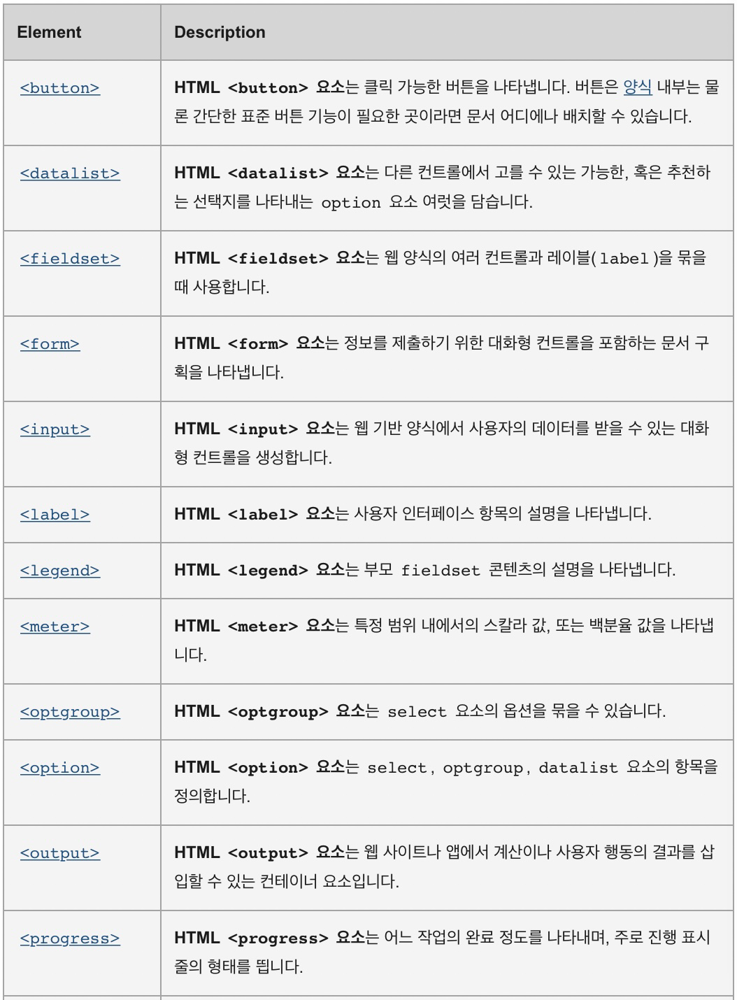

# Form tags
- Will be made only with the HTML.
- Learn power of the tags and attributes!
- Is used when **`Some inputs should be put into the webpage`**



## 1) Form
- It is used for wrapping the other form-related tags.
- Used to hand the information to the server.
  ```HTML
   Input is a self-closing tag.
   <form>
      <input \>
   </form>
  ```

<br>

## 2) input
- Can be used in many ways if you add type attribute.
- Will allow all kinds of inputs that user can place with in the webpage

<div>
   <iframe 
      id="inline"
      src="https://developer.mozilla.org/ko/docs/Web/HTML/Element/Input"
      style="width:100%; height:300px;"
   ></iframe>
</div>

  ```HTML
   Input is a self-closing tag.
      <input \>
  
  ```