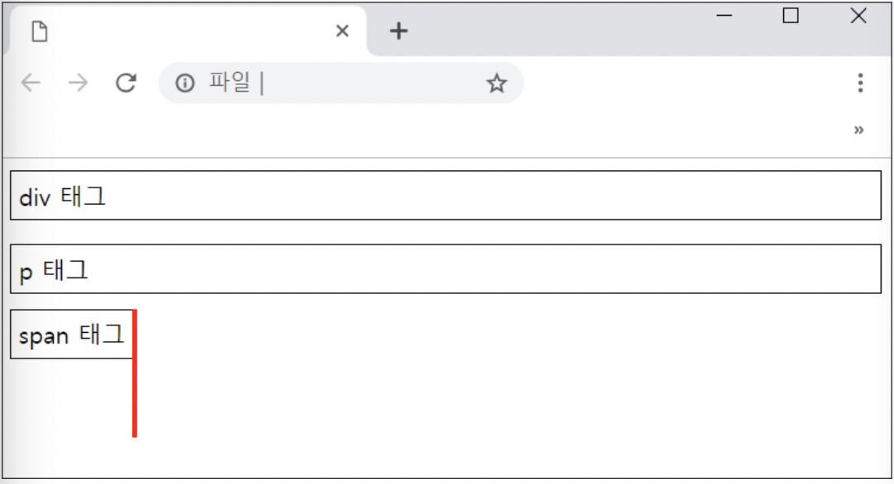
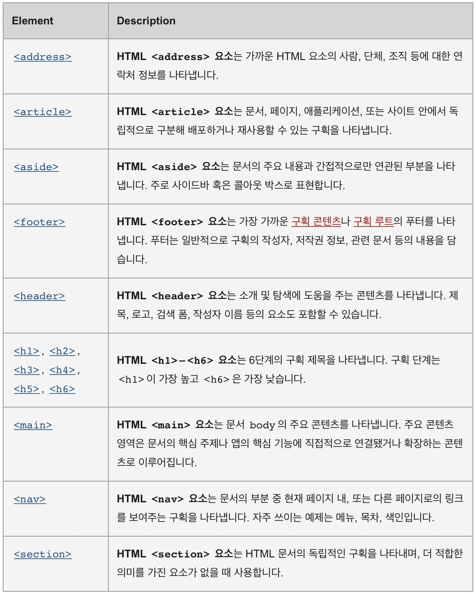

# Tags for Semantic purpose

- Serves a purpose in the HTML layout.
- Conventional, and needed to layering your HTML.

## Types

### 1) Div Tag

- Comes from word **`division`**, acts like a box.
- Difference between **<span style="color:red"> DIV vs P vs SPAN </span>**
- `No meaning added to the semantic`
  - Semantic
    - Knows from convention that, even by looking, it's meaning is obvious.
    - <span style="color:red">This will be **interpreted by the Search Engine**.</span>
  
  ```HTML
   Example code
      <div>div 태그</div>
      <p>p 태그</p>
      <span>span 태그</span>
  
  ```

   1) Block length
      
      - Span : Span is a inline, it's length is as long as the content length.
      - Div, P : Whole block is occupied.
   2) What order can the 3 include each other?
      - div can have any p, span tags.
      - p can only have span tags.
      - span can only be placed as inlines, can't have div / p tag inside.
   3) What puropse each have?
      1) P : Text paragraph separation.
      2) span : inline, works only for the content it has.
      3) div : When division is needed, can be applied when separation is needed for any reason.
         - ex) CSS needs separation.

<br>

### 2) Header

- Just the same as div but its Sematic code.

  ```HTML
    Use to use this syntax
    ...
    <div id="header">
      ...
    </div>
    ...

    Now we use this syntax more.
    ...
    <Header>
      ...
    </Header>>
    ...
  ```

<br>

### 3) Main

- Where main information in the Website is located.

<br>

### 4) Footer

- Where last information of the Website is located.

<br>

## Final) Other contents sectioning tags

