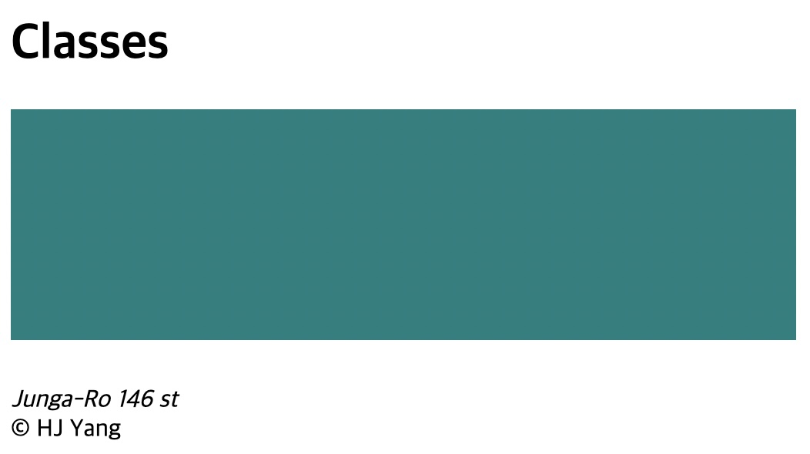
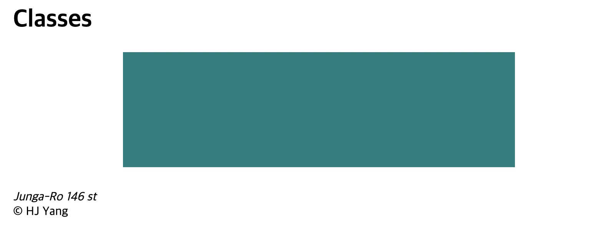
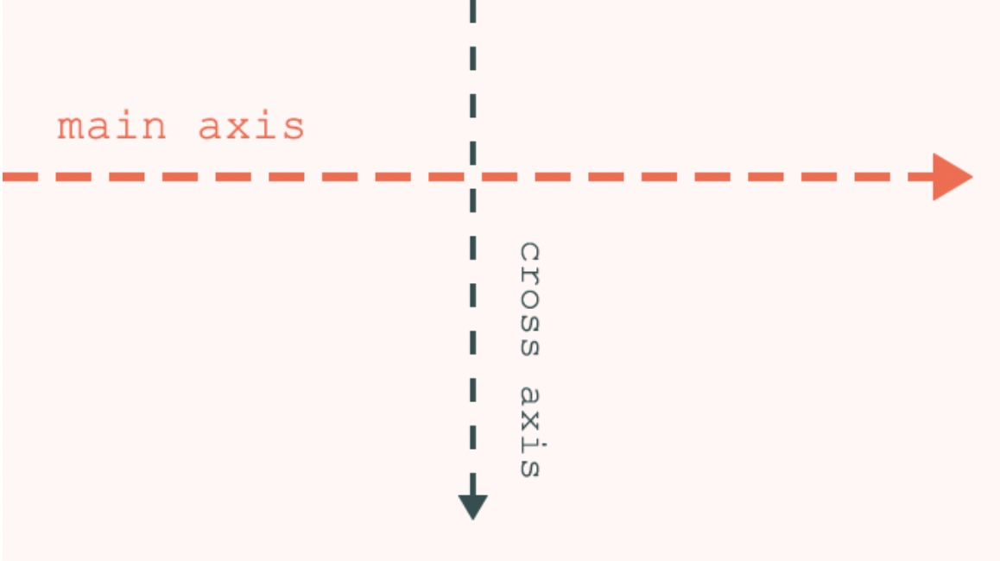
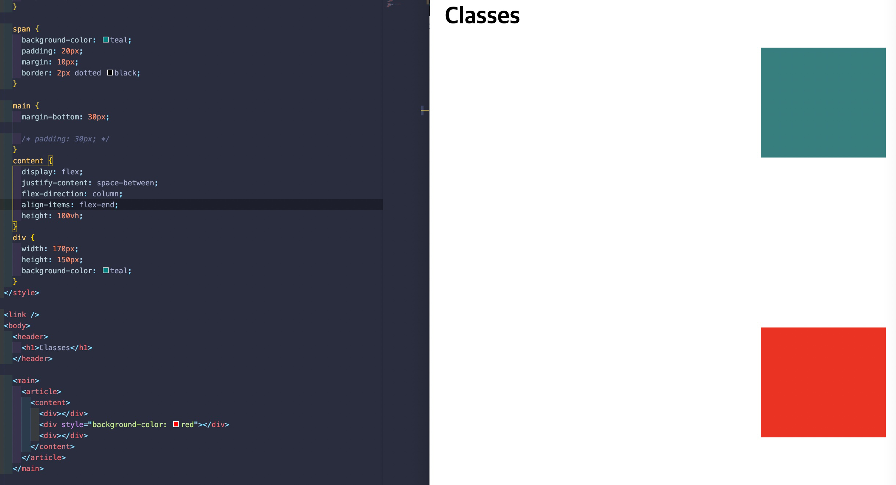
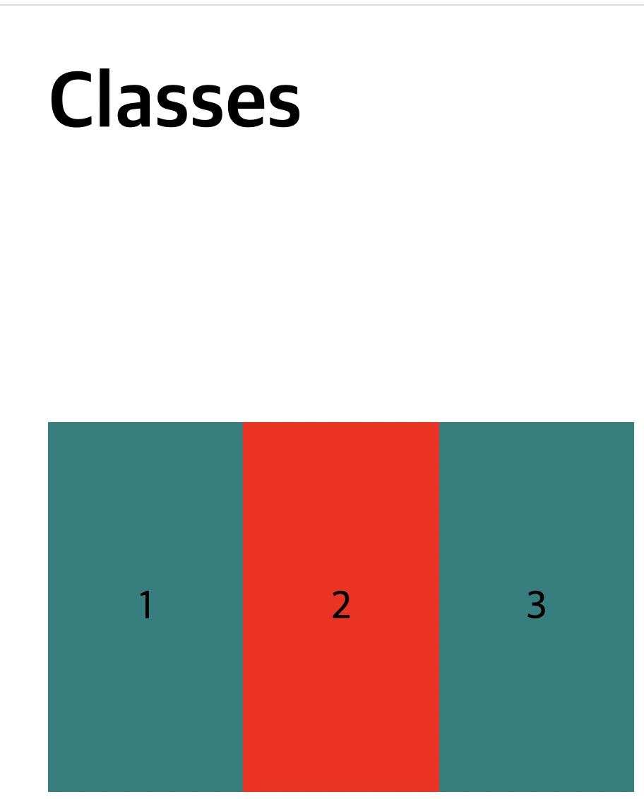
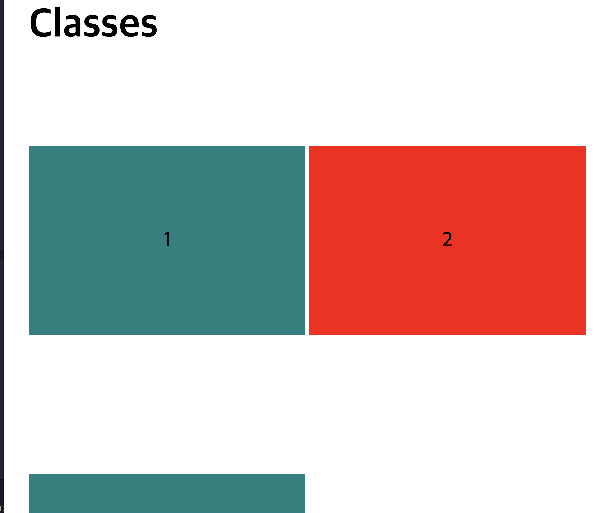
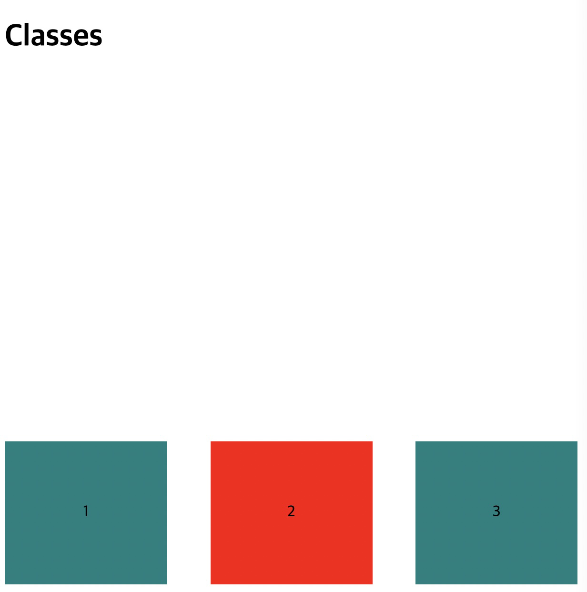

<link href="../md_config/style.css" rel="stylesheet">

# Flex

## 1) Why it came out

- Developers wanted more easier ways to deal with boxes.
- Boxes were able to manipulated not regarding with the size of the monitor.

## 2) Additional height/width param

- **`Viewport height : it will change accordingly with the screensize.`**
- Example

  ```CSS
    content {
      display: flex;
      justify-content: space-between;
      align-items: center;
      height: 100vh;
    }
  ```

## 3) Rule

### 1. Rule 1

- If you want to move elements, you must **`set flex property to the parent`**.
- This makes the parent, a flex-container, which has main axis + cross-axis.
- Example

  - You set flex to content-tag if you want to move div tags.
    ```HTML
        <main>
          <article>
            <content>
              <div></div>
              <div></div>
              <div></div>
            </content>
          </article>
        </main>
    ```
    ```CSS
      content {
        display: flex;
      }
      div {
        width: 170px;
        height: 150px;
        background-color: teal;
      }
    ```
  - Result

    

### 2. Rule 2

- By Setting Flex property, **`You unlock other properties you can use`**
- Example

  - properties
    1.  Flex-end : Align to the end
    2.  Flex-start : Defalut, align from the start
    3.  Space-evenly : Display everything evenly
    4.  Space-between : Display everything evenly and widely
    5.  Center : Align to the center
    6.  Stretch : Stretches the block / needs no fixed height or width
    7.  Reverse will really reverse order everything(consider when its neccessary - not really commonly used)
  - Center
    ```CSS
       content {
         display: flex;
         justify-content: center;
       }
    ```
  - Result

    

### 3. Rule 3

- Flex also can effect vertically
- CSS vertical / horizontal axis
- [Link - MDN](https://developer.mozilla.org/ko/docs/Web/CSS/CSS_Flexible_Box_Layout/Basic_Concepts_of_Flexbox)
- Terms
  1. Main axis : control with **`Justify-content`**
  2. Cross axis : Control with **`Align-items`**
- Example
  <div style="display:flex; justify-content:center; flex-direction:column; align-items: center;">

    
    <div style="display:block; text-align:center; ">Image 1 : Flex arrow directions by default</div>

  </div>

<br>

- <span style="color:red; font-weight:bold;">This Main(horizontal) / Cross axis(vertical) mapping can be changed later if you want to!</span>

### 4. Change axis

- With **`Flex-direction`** is added it changes.
- flex-direction : row; is set as default without anything added,  
  if you change it to flex-direction : column

  > (1) main axis = vertical, (2) Cross-axis = horizontal  
  > Justify-content = always Main axis, Align-center = always cross axis

- Example

  - 1. flex-direction : column (now main axis if vertical)
  - 2. align-items : flext end (now flex-end at the axis horizontal)

  

### 5. Flex-wrapping

- This is when screen size is smaller than the element's size
  - This is about block-elements because it has height and a width.
- Example : When it's squeezed

  1. No-wrap

     1. CSS

        - flex-wrap: nowrap is by default

        ```CSS

          content {
            display: flex;
            justify-content: space-between;
            align-items: center;
            height: 100vh;

            flex-wrap: no-wrap; // parent's property
          }
          div {
            display: flex;
            flex-direction: row;
            justify-content: center;
            align-items: center;
            width: 170px;
            height: 150px;
            background-color: teal;
          }

        ```

     2. HTML

        ```HTML
        <content>
          <div>1</div>
          <div style="background-color: red">2</div>
          <div>3</div>
        </content>

        ```

     3. Result

        - <span style="color:red; font-weight:bold; ">div is shrunk more thant the initial width! (width:150px)</span>
          
        - Elements still on the same line, squeezed -> because of the initial layout + flex-wrap : nowrap
        - Flex box will take the initial size, and to keep it in one line, **`it will automatically change childrens' width`**

  2. Wrap

     1. CSS

        - flex-wrap: wrap

        ```CSS

        content {
          display: flex;
          justify-content: space-between;
          align-items: center;
          height: 100vh;

          flex-wrap: wrap; // changed to wrap
        }

        ```

     2. HTML

        ```HTML
        <content>
          <div>1</div>
          <div style="background-color: red">2</div>
          <div>3</div>
        </content>

        ```

     3. Result

        - <span style="color:red; text-weight:bold; ">The browser will try to fit the element much as possible to the screen as it can fit</span>
        - <span style="color:red; text-weight:bold; ">It will also respect the width and height firist initialized with the div tag(width:150px)</span>

        <br>

        

## 4) Flex with in flex

- <span style="color:red; font-weight:bold; ">2 Steps above( grandparent ) being flex & flex-container will not effect 2 steps inner tag( grandchildren's ) layout. Only direct parent being "felx-container" effects.</span>
- If you add **`display:flex`** to the parent, it will become flex-container.
- Example

  1.  HTML

      ```HTML
      <main>
        <article>
          <content>
            <div>1</div>
            <div style="background-color: red">2</div>
            <div>3</div>
          </content>
        </article>
      </main>
      ```

          <br>

  2.  CSS

      ```CSS
      div {
        display: flex;
        flex-direction: row;
        justify-content: center;
        align-items: center;

        width: 170px;
        height: 150px;
        background-color: teal;
      }
      ```

  3.  Result

  - Now the content inside can also be aligned
    
