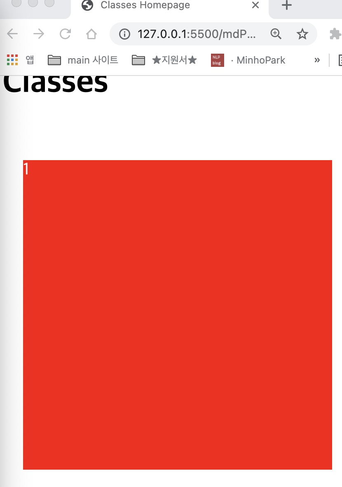
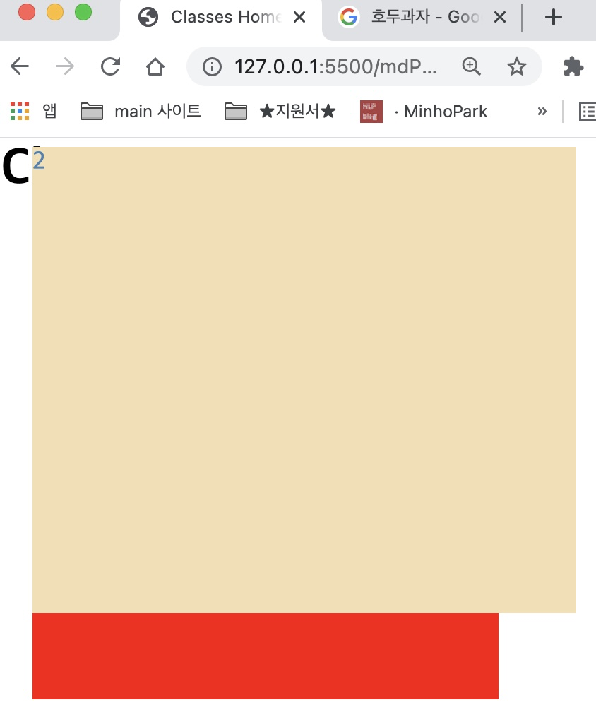
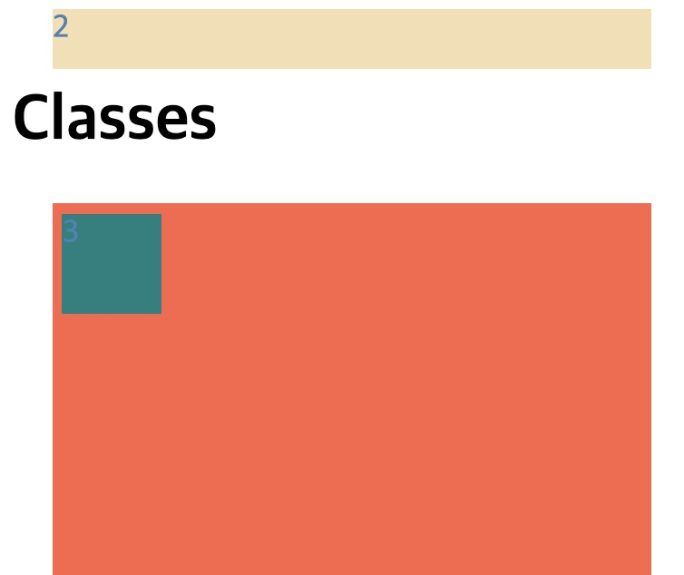
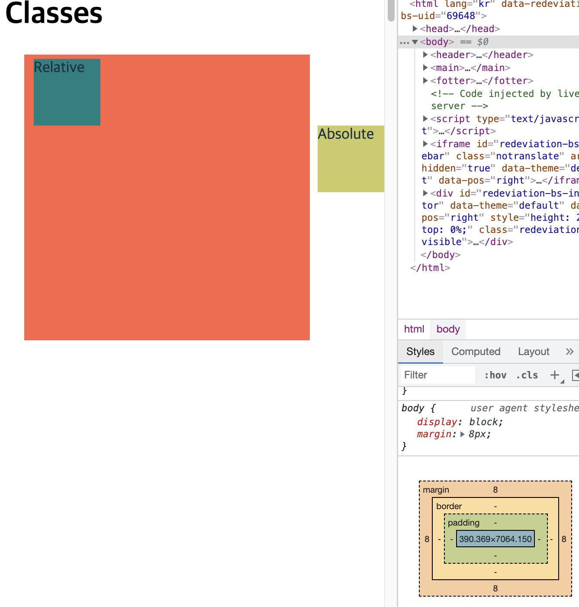
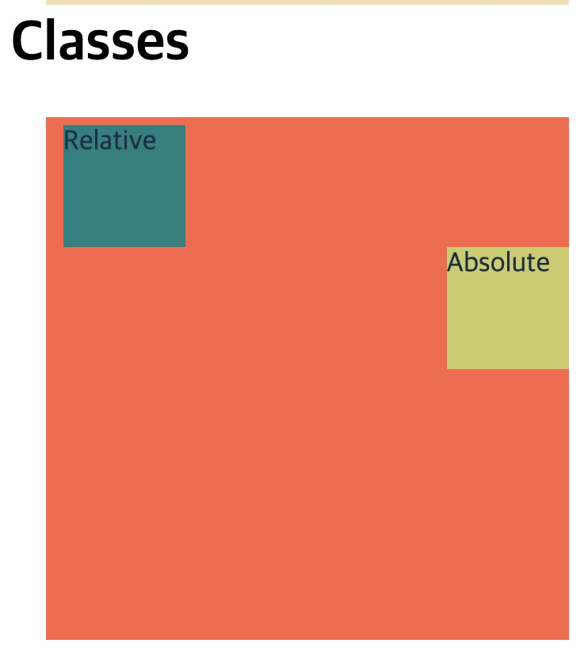

<link href="../md_config/style.css" rel="stylesheet">
# Fixed / Posiiton layout

## 1) Posiiton

- Used when you want to move a element just a tiny bit.
- Fixed, Static ... many attributes
  > 1. Fixed : set the position of box where it was initially placed.
  > 2. Static : Almost like the Fixed
  > 3. Relative : Just move it a little bit to a direction.
  > 4. Absolute : Place the box in the absolute reagarding the closest regarding father element
- Example

  - HTML

    ```HTML
      <main>
        <article>
          <content>
            <div>1</div>
          </content>
        </article>
      </main>
    ```

  - CSS

    ```CSS
      main {
        height: 1000vh;
        /* height: 100vh; */
        margin: 20px;
      }
      div {
        position: fixed; // this fixes the element in initial position

        width: 300px;
        height: 300px;
        color: whitesmoke;
        background-color: red;
      }
    ```

  - Result

    - Red element is fixed in the position

        

## 2) Fixed

- As mentioned above, **`position: fixed`** property allows the element to stay in one place

  > Note: If you add any properties like  
  > **`top: xx, bottom: xx, right: xx, left: xx`** in the CSS,  
  >  positon will not be set in the initial layout.
  >
  > > This places the element in the whole other layer.
  > > ex) Top property will fix the element's top and place it in the other layer.

- Example

  - HTML
    ```HTML
      <main>
        <article>
          <content>
            <div>1</div>
            <div id="different">2</div>
          </content>
        </article>
      </main>
    ```
  - CSS

    ```CSS
        div {
        /* position: fixed; */

        width: 300px;
        height: 300px;
        color: steelblue;
        background-color: red;
      }
      #different {
        top: 5px; // top, bottom, left, right 등도 있음
        position: fixed;

        background-color: wheat;
        width: 350px;
      }
    ```

  - Result
    

## 3) Static

- Fixes the box position
- Maybe its the same as **`position: fixed`** (?)

## 4) Relative

- Starts from the initial position at the beginning.
- With **`position: relative`** attribute added you unlock top, bottom, left, right attributes in the CSS.
- You can micro adjust using the above attributes.
- Example

  - HTML
    ```HTML
    <main>
      <article>
        <content>
          <div id="different">2</div>
          <div id="red">
            <div id="green">3</div>
          </div>
        </content>
      </article>
    </main>
    ```
  - CSS

    ```CSS
    #green {
      position: relative; // This!
      top: 5px; // 1
      left: 5px;  // 2

      background-color: teal;
      height: 50px;
      width: 50px;
    }
    ```

  - Result
    - Position has been moved by 5 pixels
      

## 5) Absolute

- **`Will align itself according with the closest-relative parent`**
- This means, the browser will check cascading upwards for parent with position: relative CSS property True (Until it finds it)
- If it don't finds it, **`it will align itself with body tag!`**
- **`Having a position:relative tag doesn't effect the parent tag to have a relative attriubute. You need to set it mannualy`**
  > Note : This absolute child and relative-parent(father) is important  
  > You will be using alot of this type of CSS layout, its common.
- Examples

  1. Example : direct parent not relative

     - HTML
       ```HTML
       <main>
         <article>
           <content>
             <div id="different">2</div>
             <div id="red">
               <div id="green">Relative</div>
               <div id="yellow">Absolute</div>
             </div>
           </content>
         </article>
       </main>
       ```
     - CSS

       ```CSS
       #red {
         background-color: tomato;
         position: unset; // this makes the red box not relative, browser makes the <body> tag the relative
       }
       #green {
         position: relative;
         margin: 5px;
         top: 5px;
         left: 5px;

         background-color: teal;
         height: 70px;
         width: 70px;
       }
       #yellow {
         position: absolute;
         right: 0px;

         background-color: rgb(203, 203, 101);
         height: 70px;
         width: 70px;
       }
       ```

     - Result  
       

  2. Example 2 : Red box has relative position attribute

     - CSS
       ```CSS
       #red {
         background-color: tomato;
         position: relative;
       }
       ```
     - Result
       
