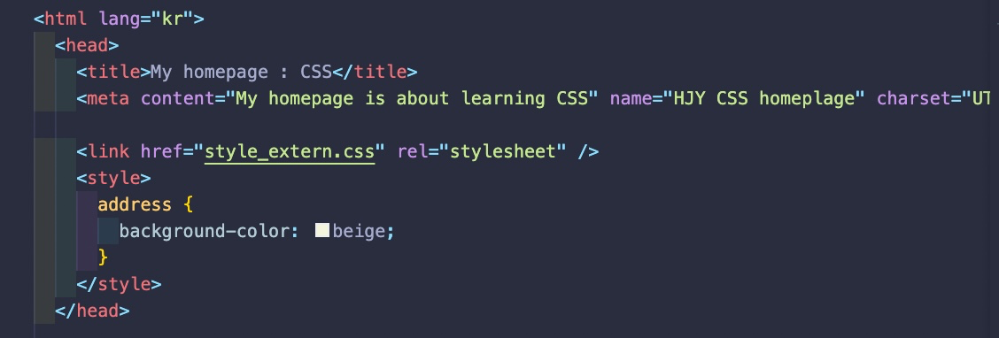
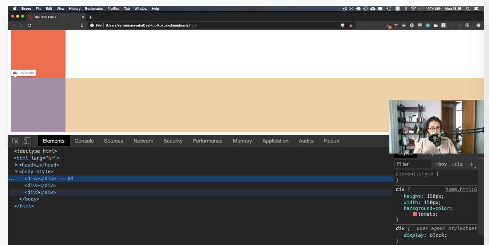

<link href="../md_config/style.css" rel="stylesheet">

# css

## 1) Cascading Style sheet

- Why Cascading?

  - Like a water-fall
  - Browser will read css from the **`Top to the End`**.
  - CSS on the top will be replaced with one after.
      
      
    whatever was placed last, will be shown as the CSS.

- Select the tag that is going tobe pointed by CSS.
  1. Tag names
  2. class names #
  3. id name .
  4. \* selects every tags

## 2) Blocks and inlines

- From the example we can learn that there are so many boxes.
  
- Basic Box is configured from \
\

1. **`Block : Not allow other elemnets next to itself.`**

   > Note : This is called "block"
   > Also called "box"

   - Div, body, header, main, section, article, footer... everything will not allow any content next to itself.
     - Even with 150px X 150px with Div, nothing comes next.
       

2. Inline : Allows other elemnets next to itself.

   > Note : This is same as inline(in the same line.
   >
   > > Easier to remember tags that are inlines, many of the tags are blocks.
   > >
   > > 1. Span
   > > 2. a
   > > 3. image  
   > >    Very important : inlines don't have width & height  
   > >    They have padding all directions  
   > >    They don't have margins on top and bottom, but have margins on right and left

   

- Span will allow something next to itself.
  
