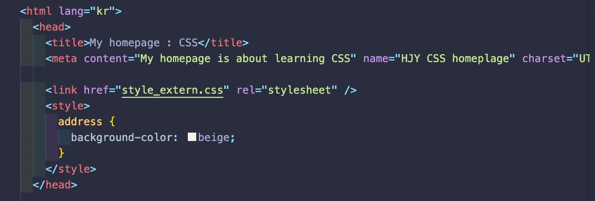
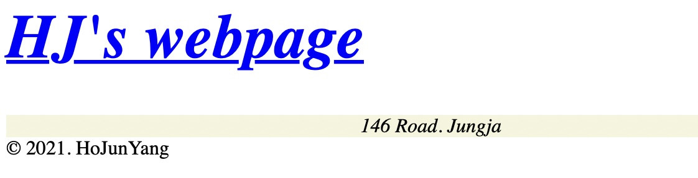
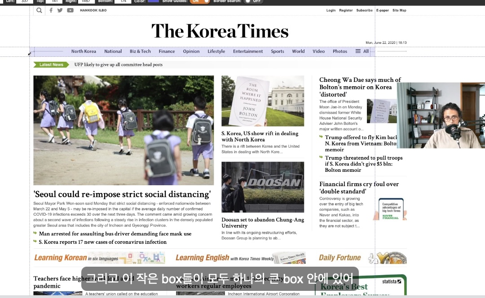
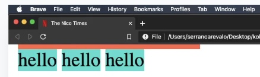

# css

## 1) Cascading Style sheet

- Why Cascading?

  - Like a water-fall
  - Browser will read css from the **`Top to the End`**.
  - CSS on the top will be replaced with one after.
      
      
    whatever was placed last, will be shown as the CSS.

- Select the tag that is going tobe pointed by CSS.
  1. Tag names
  2. class names #
  3. id name .

## 2) Blocks and inlines

- From the example we can learn that there are so many boxes.
  
- Basic Box is configured from \
\

1. **`Not allow other elemnets next to itself.`**

   > Note : This is also called "block"

   - Div, body, header, main, section, article, footer... everything will not allow any content next to itself.
     - Even with 150px X 150px with Div, nothing comes next.
       

2. Allow other elemnets next to itself.
   > Note : This is same as inline(in the same line)
   > Also called "box"
   >
   > > Easier to remember tags that are inlines, many of the tags are blocks.
   > >
   > > 1. Span
   > > 2. a
   > > 3. image

- Span will allow something next to itself.
  
