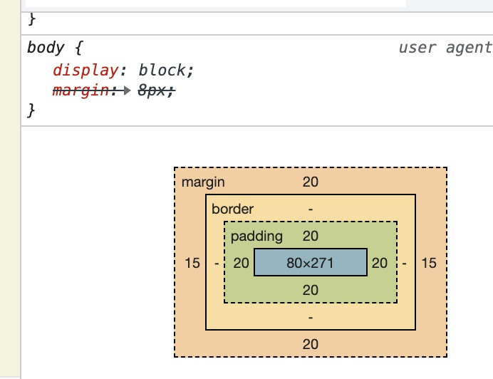

# Padding

## 1) property

- Margin : Space from boarder to the outside.
- Padding : Space from boarder to the inside.
  - If confronted with Collapsing-margin just use padding for space required.
  - Any syntax is same as the Margin.
  - This is applied to **`the tag owns the property`**,  
    meaning, if you want space for child tag, you must **`add property to the parent`**.
  - Example
    
    Google chorome shows how it is painted.
  - Padding Example
    - Select id by # string in CSS file.
    - Name of the id should be the same
    - You can also select with multiple choices by **`<tag name> #<id name>`**
      
    ```CSS
      div {
        height: 150px;
        width: 150px;
        padding: 0px 20px;
      }
      #first {
        background-color: darkgreen;
      }
      #second {
        background-color: darkmagenta;
      }
      #third {
        background-color: darkolivegreen;
      }
      #fourth {
        background-color: darksalmon;
      }
    ```
