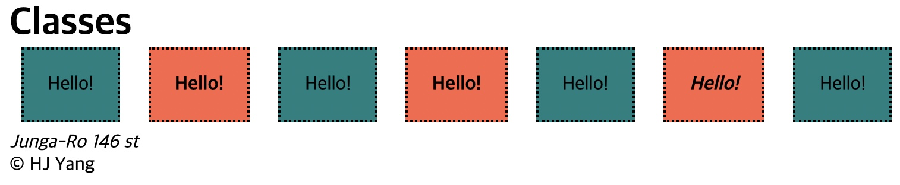

<link href="../md_config/style.css" rel="stylesheet">

# Classes

- Selecting multiple ids Example

  ```CSS

    #tom1,
    #tom2,
    #tom3 {
      background-color: tomato;
    }
  ```

- Choosing a class in HTML
- Syntax

  1. . comes, it will choose the class name
  2. cascading class names with . will select tags that contains all of them

  - CSS written

    ```CSS
      .tomato {
        font-weight: bold;
      }

      .tomato.potato {
        font-style: italic;
      }

    ```

  - HTML written
    ```HTML
      <content>
        <div>
          <span>Hello!</span>
          <span id="tom1" class="tomato">Hello!</span>
          <span>Hello!</span>

          You can define multiple class names here!
          <span id="tom2" class="tomato hello">Hello!</span>
          <span>Hello!</span>
          <span id="tom3" class="tomato potato">Hello!</span>
          <span>Hello!</span>
        </div>
      </content>
    ```
  - Output

    
