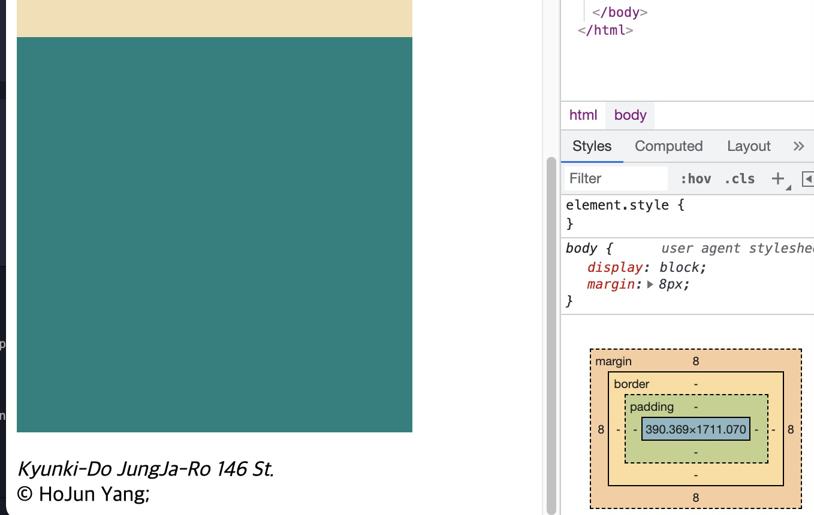
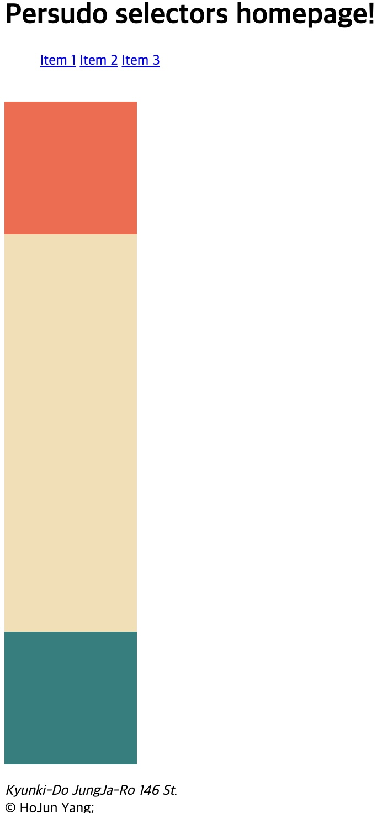
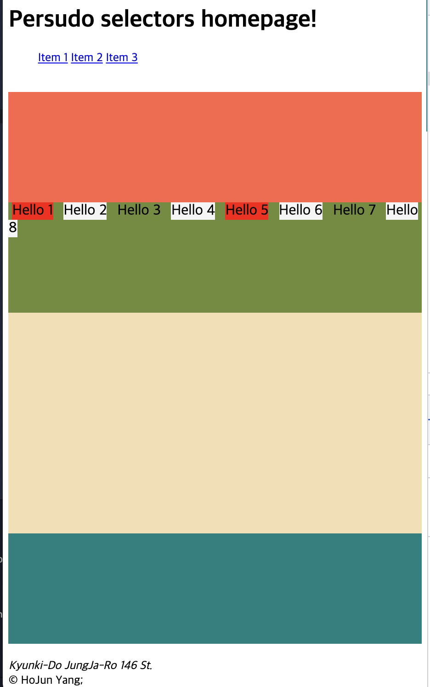

<link href="../md_config/style.css" rel="stylesheet">

# Pseudo Selectors

- What is this?

  - More complex way of selecting elements in CSS like ., # s do.
  - . : class
  - # : id
  - Nothing : tag names

- When to use?

  - When you want to select class next to span
  - When you want to select class that comes first or last in the HTML

- **`This is better than selecting everything from classes or ids or tag ; Its not repeating to create every id and class names`**

- Types
  > 1. last-child : select the last with the selected CSS
  > 2. first-child : select the first with the selected CSS
  > 3. nth-child : select the nth child(must select the tag itself, not the parent)

## 1) last-child

- Last child of the selected elements.
- Example

  - HTML
    ```HTML
    <main>
      <article>
        <content>
          <div></div>
          <div></div>
          <div></div>
          <div></div>
          <div></div>
        </content>
      </article>
    </main>
    ```
  - CSS

    ```CSS
      div {
        width: 300px;
        height: 300px;
        background-color: wheat;
        position: relative;
      }

      div:last-child {
        background-color: teal;
      }
    ```

  - Result
    

## 2) first-child

- Applied on the first element of selected elements.
- Example

  - CSS

    ```CSS
        div {
          width: 150px;
          height: 150px;
          background-color: wheat;
          position: relative;
        }

        div:last-child {
          background-color: teal;
        }

        div:first-child {
          background-color: tomato;
        }
    ```

  - Result

    

## 3) n-th child

- Applied on the n-th child of the selected elements.
- You can give a formular consisted of 'n'.
- You can give a integer value.
- Example

  - HTML
    ```HTML
    <main>
      <article>
        <content>
          <div></div>
          <div>
            <span>Hello 1</span>
            <span>Hello 2</span>
            <span>Hello 3</span>
            <span>Hello 4</span>
            <span>Hello 5</span>
            <span>Hello 6</span>
            <span>Hello 7</span>
            <span>Hello 8</span>
          </div>
          <div></div>
          <div></div>
          <div></div>
        </content>
      </article>
    </main>
    ```
  - CSS

    ```CSS
      span {
        font-size: 20px;
        margin: 5px;
        /* display: block; */
        height: 30px;
        width: auto;
      }
      span:nth-child(even) {
        background-color: whitesmoke;
      }
      span:nth-child(4n + 1) {
        background-color: red;
      }
      content {
        height: 1000vh;
        margin: 50px;
      }
      div {
        width: auto;
        height: 150px;
        background-color: wheat;
        position: relative;
      }

      div:last-child {
        background-color: teal;
      }
      div:nth-child(2) {
        background-color: rgb(111, 139, 55);
      }
      div:first-child {
        background-color: tomato;
      }
    ```

  - Result

    
