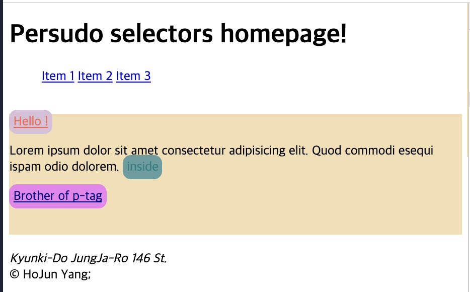

<link href="../md_config/style.css" rel="stylesheet">

# Combinators

- Method to write consecutive selectors so you can inidicate elements you want.
- **`This will still work even if it's not a direct parent-children relationship`**
- Methods:
  > 1. cascade tag names, or class names... : will be matched with every tags with the same order
  > 2. \> : write between tags, and it will select direct parent-child
  > 3. \+ : write between tags, and it will select direct next brother relationship tags.

<br>

## 1) single combination

- Selecting with only combination
- Example

  - HTML
    ```HTML
    <main>
      <article>
        <content>
          <div>
            <span>Hello !</span>
            <p>Lorem ipsum dolor sit amet consectetur adipisicing elit. Quod commodi esequi ispam odio dolorem. <span>inside</span></p>
          </div>
        </content>
      </article>
    </main>
    ```
  - CSS

    ```CSS
        div {
          width: auto;
          height: 150px;
          background-color: wheat;
          position: relative;
        }

        span {
          color: tomato;
        }
        p span {  /* Here, browser looks for p tag that has span*/
          color: teal;
        }
    ```

  - Result
    - Inside color has "teal" color!
    - **`Browser will look for the pattern you put`**
    - Pattern can me more than 2
      

<br>

## 2) Select only the 1st span in the example

- When you want to select only the 1st span
- Example

  - Because, div span **`will work on span tags not direct child of div tag`** , all the spans are selected.
  - HTML

    ```HTML
    <main>
      <article>
        <content>
          <div>
            <span>Hello !</span>

            <p>Lorem ipsum dolor sit amet consectetur adipisicing elit. Quod commodi esequi ispam odio dolorem. <span>inside</span></p>
          </div>
        </content>
      </article>
    </main>
    ```

  - CSS

    ```CSS
      div {
        width: auto;
        height: 150px;
        background-color: wheat;
        position: relative;
      }

      span {
        background-color: cadetblue;
        color: tomato;
        padding: 5px;
        border-radius: 10px;
      }
      div span {
        text-decoration: underline;
        background-color: thistle;
      }
      p span {
        color: teal;
      }
    ```

  - Result
    

## 3) Select direct siblings

- selecting direct siblings
- Example

  - CSS
    ```CSS
    /* Change CSS to this, add > in bewtween, meaning the direct child */
      div > span {
        text-decoration: underline;
        background-color: thistle;
      }
    ```
  - Result
    

## 4) Select brother tag right next

- Example 1

  - HTML

    ```HTML
    <main>
      <article>
        <content>
          <div>
            <span>Hello !</span>

            <p>Lorem ipsum dolor sit amet consectetur adipisicing elit. Quod commodi esequi ispam odio dolorem. <span>inside</span></p>

            <span>Brother of p-tag</span>
          </div>
        </content>
      </article>
    </main>
    ```

  - CSS

    ```CSS
      span {
        background-color: cadetblue;
        color: tomato;
        padding: 5px;
        border-radius: 10px;
      }
      div > span {
        text-decoration: underline;
        background-color: thistle;
      }

      p span {
        color: teal;
      }

      p + span { /* This selects the span tag right after the p tag */
        background-color: violet;
        color: navy;
      }
    ```

  - Result
    

- Example 2 : complex combinations

  - Also same effect, but check if more complex style works
  - HTML

    ```HTML
    <main>
      <article>
        <content>
          <div>
            <span>Hello !</span>

            <p>Lorem ipsum dolor sit amet consectetur adipisicing elit. Quod commodi esequi ispam odio dolorem. <span>inside</span></p>

            <span>Brother of p-tag</span>
          </div>
          <p>Ignore me!</p>
        </content>
      </article>
    </main>
    ```

  - CSS

    ```CSS
    ...

      div > p + span { /* This also works, it can be cascaded */
        background-color: violet;
        color: navy;
      }

    ...
    ```

  - Result

    - The "Ignore me!" part \<p> tag is not selected
    - Works same as (4) example

    

## 5) Select Brothers not right next to a tag

- Example 1 : Not working properly

  - HTML

    ```HTML
      <content>
        <div>
          <span>Hello !</span>

          <p>Lorem ipsum dolor sit amet consectetur adipisicing elit. Quod commodi esequi ispam odio dolorem. <span>inside</span></p>
          <aside>This is Aside</aside>
          <span>Brother of p-tag</span>
        </div>
        <p>Ignore me!</p>
      </content>
    ```

  - CSS

    ```CSS
    p span {
      color: teal;
    }

    div > p + span {
      background-color: violet;
      color: navy;
    }
    ```

  - Result
    

- Example 2 : Working properly with /~ combinator

  - CSS
    ```CSS
    div > p ~ span {
      background-color: violet;
      color: navy;
    }
    ```
  - Result
    
