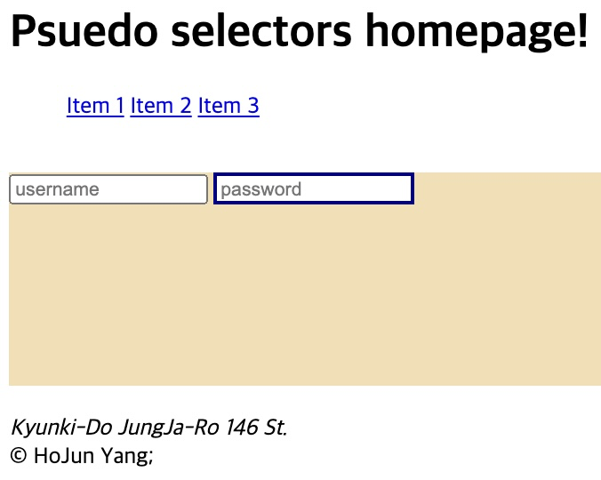
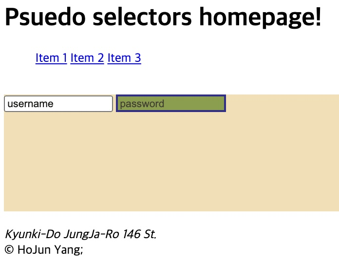
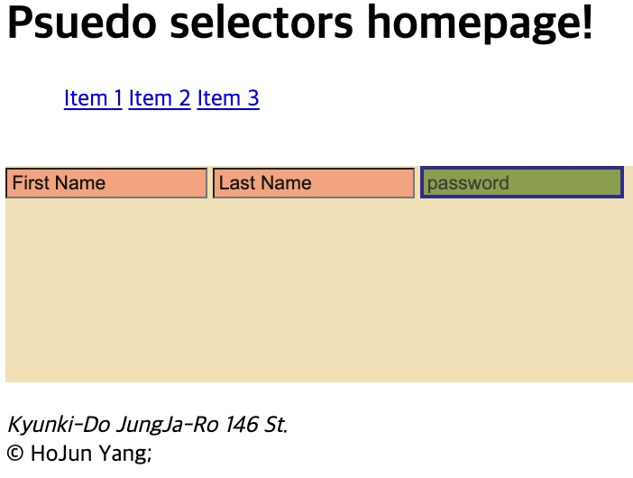

<link href="../md_config/style.css" rel="stylesheet">

# Pseudo Selectors pt2

[ **`Link for more description in MDN about Pseduo`** ](https://developer.mozilla.org/ko/docs/Web/CSS/Pseudo-classes)

## 1) \<inputs> and persudos with it

- **`Anything can come in the \<input> spot, with a tag name`**

1. input: required

   - Select the required input
   - Example

     - HTML

       ```HTML
           <div>
             <form>
               <input type="text" placeholder="username" />
               <input type="password" required placeholder="password" />
             </form>
           </div>
       ```

     - CSS

       ```CSS
       input:required {
         border-width: 3px;
         border-style: solid;
         border-color: navy;
       }
       ```

     - Result
       

## 2) Selecting Attributs

- [ **`Link for more description in MDN selectors`** ](https://developer.mozilla.org/ko/docs/Web/CSS/Attribute_selectors)

  1.  input[type="password"]

  - Select the tag with existing attribute
  - This can select almost anything
  - Example
    - HTML
      ```HTML
      <div>
        <form>
          <input type="text" placeholder="username" />
          <input type="password" required placeholder="password" />
        </form>
      </div>
      ```
    - CSS
      ```CSS
      input:required {
        border-width: 3px;
        border-style: solid;
        border-color: navy;
      }
      input[type="password"] {
        background-color: olivedrab; // see if this works
        opacity: 80%;
      }
      ```
    - Result
      

  2. input[placeholder~="name"]

     - This can select tags which has **`part of the attribute value`**
     - Example
       - HTML
         ```HTML
         <content>
           <div>
             <form>
               <input type="text" placeholder="First Name" />
               <input type="text" placeholder="Last Name" />
               <input type="password" required placeholder="password" />
             </form>
           </div>
         </content>
         ```
       - CSS
         ```CSS
         input[placeholder~="Name"] { // attribute contains a word "Name"
           background-color: lightsalmon; // backgorund changed
           opacity: 80;
         }
         ```
       - Result
         
