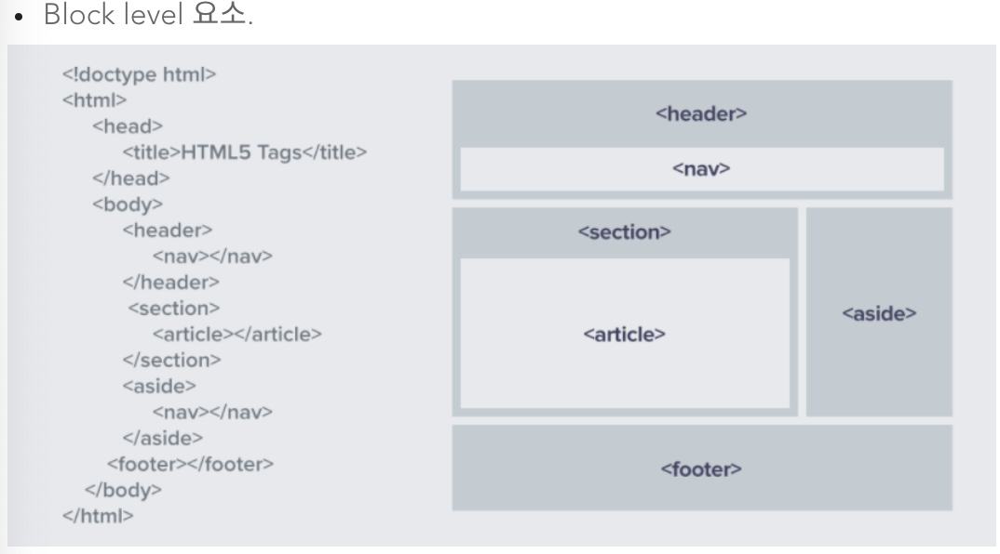
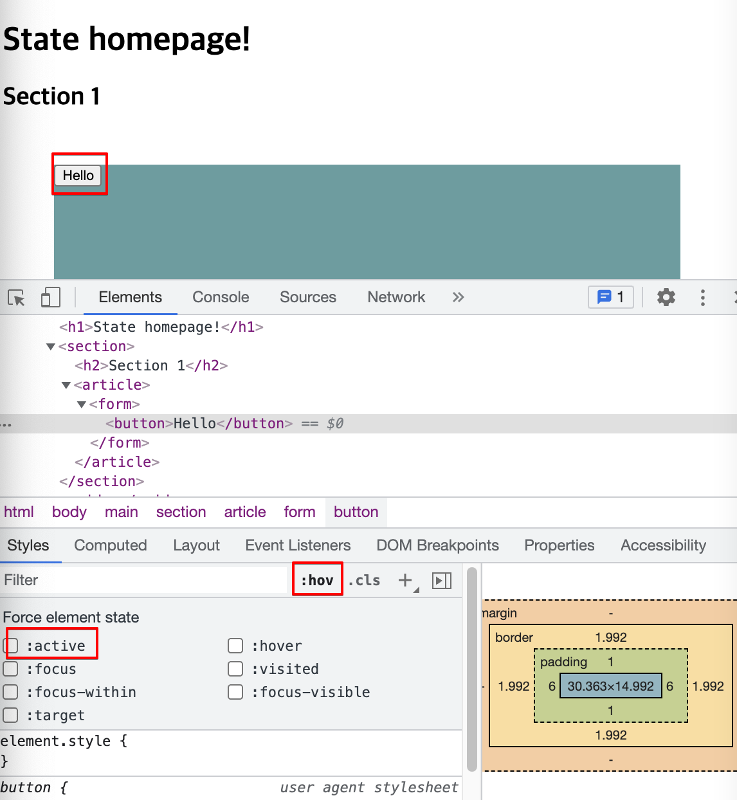
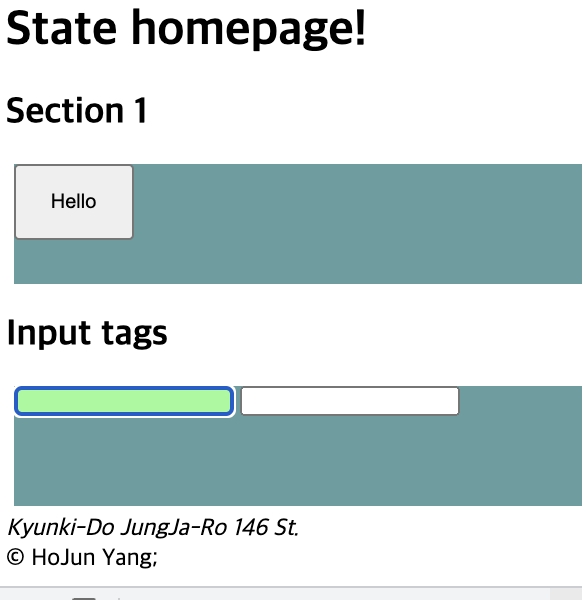
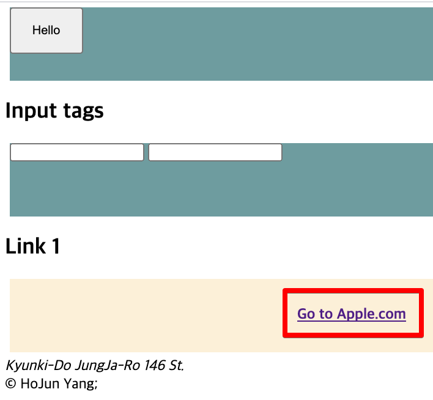
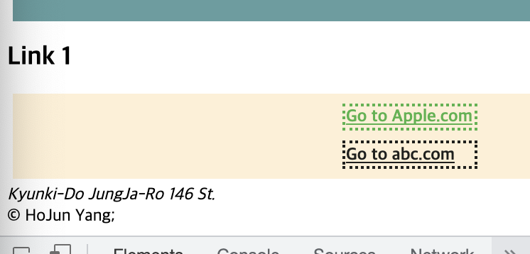
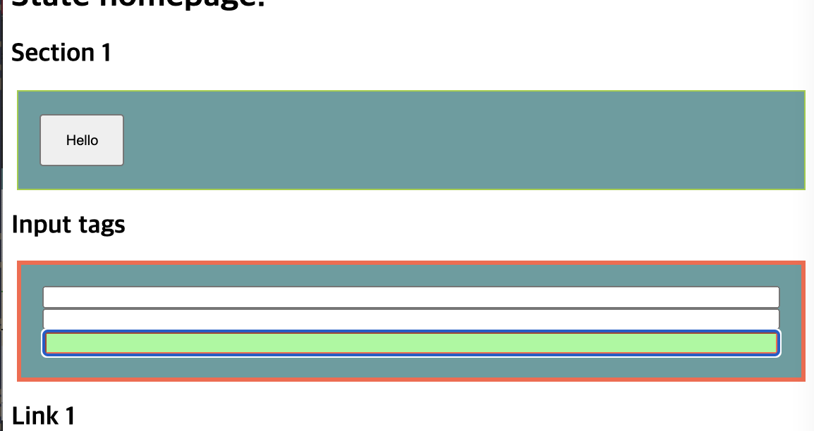
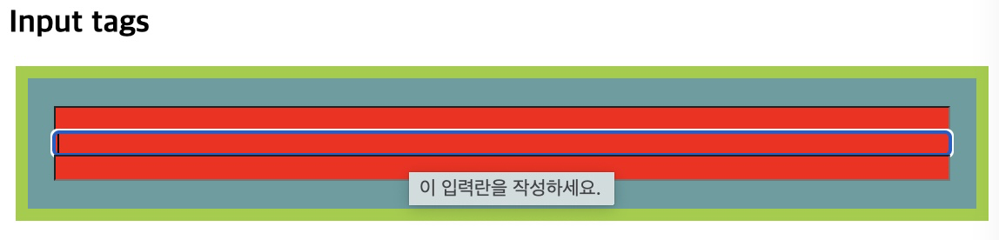

<link href="../md_config/style.css" rel="stylesheet">

# State

- HTML semantic tag layout

    

- Types
  1. Active : element is clicked now and staying that way
  2. Hover : mouse is over the element
  3. Focus : keyboard tab is at the element
  4. Focus-within : Parent has a focused child
  5. Visited : link is visited

> Note : 다음의 경우와 같이, init에 작성한 경우, syntax를 바꿔줘야 CSS가 적용되는 경우가 있음
>
> 1. 구글 크롬 : 강력 새로고침(브라우저가 CSS를 캐싱하는 경우가 있음)
> 2. CSS 더 명시적인 attribute로 다음과 같이 수정
>
> > ```HTML
> >    <article>
> >      <form>
> >        <input type="text" required placeholder="" name="" id="" />
> >        <input type="text" required placeholder="" name="" id="" />
> >        <input type="text" required placeholder="" name="" id="" />
> >     </form>
> >    </article>
> > ```

- CSS

  ```CSS
    article :focus-within {
      /* border: 10px soild tomato; */
      border-color: tomato;
      border-width: 4px;
    }
  ```

## 1) Active

- State When on click and while its pressed

- Example
  

- HTML
  ```HTML
  <main>
   <h1>State homepage!</h1>
   <section>
     <h2>Section 1</h2>
     <article>
       <form>
         <button>Hello</button>
       </form>
     </article>
   </section>
   <aside></aside>
  </main>
  ```
- CSS

  ```CSS

   button:active {
     background-color: cornflowerblue;
   }
  ```

- Result  
  

## 2) Hover

- State When mouse is over the element
- Example
  - CSS
    ```CSS
      button:hover {
        color: orange;
      }
    ```
  - Result  
    

## 3) Focus

- Not clicking(not like active)
- Focus is when selected by keyboard
- Example

  - HTML

    ```HTML
    <main>
      <h1>State homepage!</h1>
      <section>
        <h2>Section 1</h2>
        <article>
          <form>
            <button>Hello</button>
          </form>
        </article>
      </section>
      <section>
        <h2>Input tags</h2>
        <article>
          <form>
            <input type="text" required placeholder="" />
            <input type="text" required placeholder="" />
          </form>
        </article>
      </section>
      <aside></aside>
    </main>
    ```

  - CSS

    ```CSS
      input:focus {
        background-color: palegreen;
      }
    ```

  - Result

    
    

## 4) Visited

- If visited, the anchor tag turns blue to purple.
- Example

- HTML
  ```HTML
      <section>
        <h2>Input tags</h2>
        <article>
          <form>
            <input type="text" required placeholder="" />
            <input type="text" required placeholder="" />
          </form>
        </article>
        <h2>Link 1</h2>
        <article>
          <a id="link-block apple" href="https://apple.com">Go to Apple.com</a>
          <a id="link-block abc" href="https://abc.com">Go to abc.com</a>
        </article>
      </section>
  ```
- CSS
  ```CSS
    section:nth-child(3) > article ~ article {
      background-color: papayawhip;
      display: flex;
      flex-direction: column;
      justify-content: space-evenly;
      align-items: center;
    }
    a[id~="link-block"] {
      width: 120px;
      color: rgb(31, 32, 29);
      display: block;
      border: 3px dotted;
      font-weight: bold;
    }
    a:visited {
      color: rgb(71, 179, 71);
      font-style: oblique;
    }
  ```
- Result  
    
  

## 5) Focus-within

- When a element inside a parent is focused, you can access CSS attributes of the parent
- Example

  - HTML
    ```HTML
      <h2>Link 1</h2>
      <article>
        <a id="link-block apple" href="https://apple.com">Go to Apple.com</a>
        <a id="link-block abc" href="https://abc.com">Go to abc.com</a>
      </article>
    ```
  - CSS
    ```CSS
      form {
        border: 2px solid yellowgreen;
        display: flex;
        flex-direction: column;
        padding: 20px;
      }
      article :focus-within {
        /* border: 10px soild tomato; */
        border-color: tomato;
        border-width: 4px;
      }
    ```
  - Result

    

## 6) Combination with other elements

- Example

  - HTML
    ```HTML
      <h2>Input tags</h2>
      <article>
        <form>
          <input type="text" required placeholder="" name="" id="" />
          <input type="text" required placeholder="" name="" id="" />
          <input type="text" required placeholder="" name="" id="" />
        </form>
      </article>
    ```
  - CSS

    ```CSS
      form {
        /* border: 2px solid yellowgreen; */
        display: flex;
        flex-direction: column;
        padding: 20px;
      }
      form:hover input {  // Combination of State and tag selection
        background-color: red;
      }
      article :focus-within {
        /* border: 10px soild tomato; */
        border-color: yellowgreen;
        border-style: solid;
        border-width: 10px;
      }

      ...

      input:focus {
        background-color: palegreen; // article-focus within overrides
        border-style: none;
      }
    ```

  - Result

    
