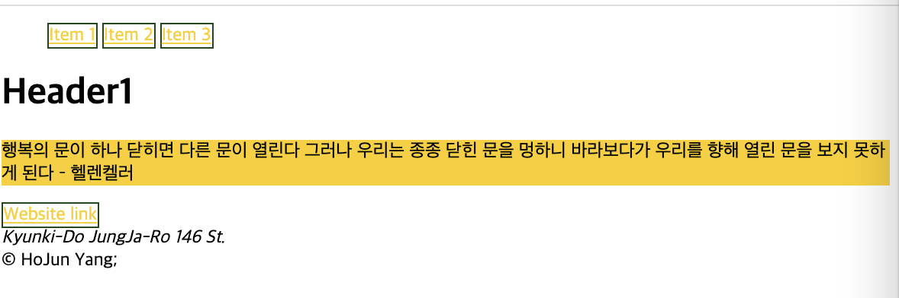

<link href="../md_config/style.css" rel="stylesheet">

# Colors & Varables

## 1) Colors

- Types of colors
  1. Hexadmical : #123456
  2. rgb : rgb(252, 206, 9)
  3. rgba (Opacity=Transparency): rgba(252, 206, 9, 0.5)

## 2) Varaibles

- How to make one

  - **`:root`** to specify the root of the DOM(applies everywhere)
  - add variables by according syntax  
    **`--<Variable name w/o space> : CSS value`**

  - Example

    - HTML
      ```HTML
        <h1>Header1</h1>
        <section>
          <article>
            <div>
              <p>
                행복의 문이 하나 닫히면 다른 문이 열린다 그러나 우리는 종종 닫힌 문을 멍하니 바라보다가 우리를 향해 열린 문을 보지 못하게 된다
                – 헬렌켈러
              </p>
              <a href="#">Website link</a>
            </div>
          </article>
        </section>
        <aside></aside>
      ```
    - CSS

      ```CSS
        :root {
          --main-color: #fcce00;
          --border-color: rgb(26, 71, 26);
          --default-border: 1.5px solid var(--border-color); // you can also set multiple key CSS syntax to a variable
        }

        p {
          background-color: var(--main-color);
        }
        a {
          color: var(--main-color);
          border: var(--default-border);
        }
      ```

    - Result

      
