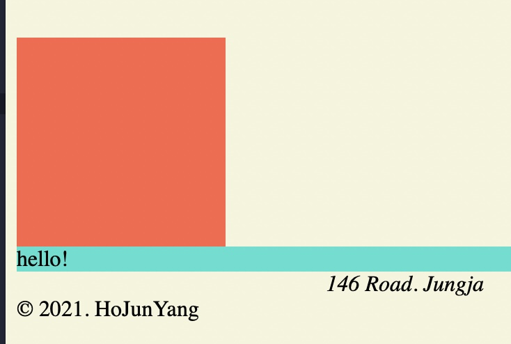
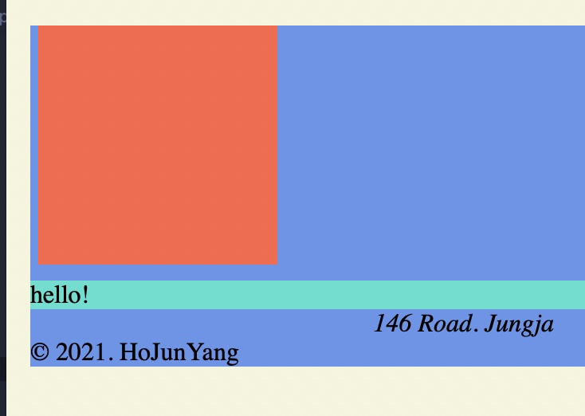

# Margin

## 1) Can you change inline to block?

- Yes, it is possible.
- You give inline tags a CSS property **`"display : block" `**
  ```HTML
      span {
        display: block;
        background-color: turquoise;
      }
  ```

## 2) Can you change block to inline?

- Yes, its possible.
- You give block tags a CSS property **`"diplay : inline"`**
- Without any contents, it will be invisable.
- <span style="color:red">It happens because "inlines" **dont have width and height except the content**</span>

  ```HTML
    div {
      height: 150px;
      width: 150px;
      background-color: whitesmoke;
      display: inline;
    }

  ```

## 3) Basic Style Browser gives you

### 1) Margin

- **`Space from boarder to the outside.`**
- If you want to get rid of it, `**give "margin:0px" property to the body**` or any other tags that needs such.
- Example
  
  - You will automatically have margins in the body tag given by the browser.
    (Red area)
- How to give CSS propety?
  > 1. **`Syntax of Margin`**  
  >    Margin(single pixel) or Margin-left, Margin-right ... and so on.
  > 2. **`Margin : 20px 15px;`**  
  >    Top bottom 20px, right left 15px
  > 3. **`Margin : 20px 15px 10px 5px;`**  
  >    Top, right, bottom, left each

### 2) Collapsing margins

- Will only happen vertically
- Example
  

  ```HTML
      div {
        margin: 10px 5px;
        height: 150px;
        width: 150px;
        background-color: tomato;
      }

      body {
        margin: 20px 15px;
        background-color: cornflowerblue;
      }
  ```

  This should give 10px + 20 px but the top is alligned somehow.

  - This is called Collapsing-margins, works when inner and parent boarders shares the same top / bottom vertical boarders when displayed.
  - **`Margins will be treated as one`**.
