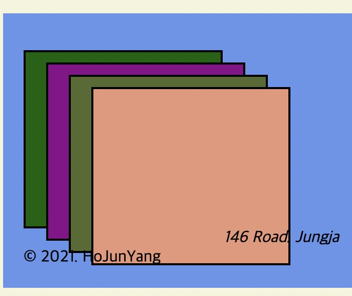
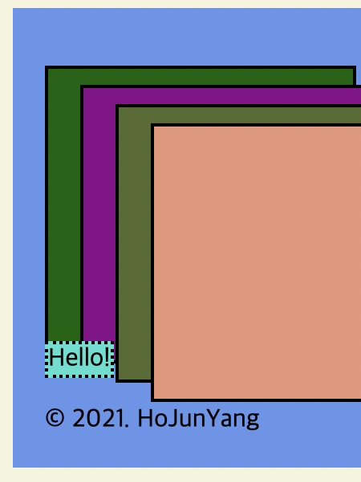

<link href="../md_config/style.css" rel="stylesheet">

# Borders

## 1) What is Borders

- Boders is the box's border itself.
- Blocks and inlines both have borders of it's own.
- There are many borders but use only one thats pretty!
  - [Link](https://developer.mozilla.org/ko/docs/Web/CSS/border-style)
  - Use Solid borders
  - Syntax
    1. Thickness(pixels) + Border Type + color
- Example

  1.  Block

      ```CSS
            div {
              height: 150px;
              width: 150px;
              padding: 10px 20px;
              border: 2px solid black;
            }

            This selects every tags
            * {
              boder: 2px;
            }
      ```

      

  2.  Inline

      - This also works for inlines.

      ```CSS
        span {
          /* display: block; */
          background-color: turquoise;
          border: 2px dotted black;
        }
      ```

      
