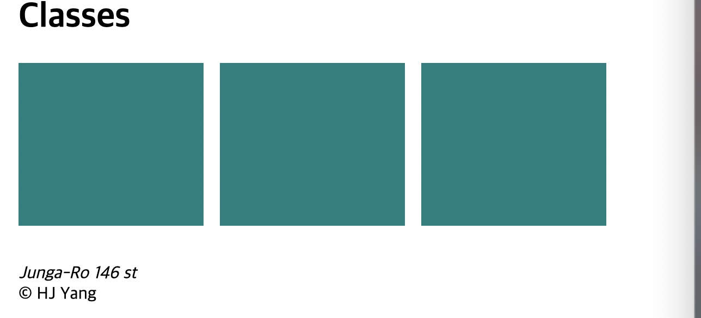

<link href="../md_config/style.css" rel="stylesheet">

# Inline Block

- Basic display is **`Block`**
- **`Inline-Block`** can give you width and height at be treated as inline.
- Downside of Inline Block
  1. It creates space between inline boxes, don't know why but it exists.
  2. No structural form (right margin to the end of the frame is bigger than that of left - will you keep using margin properties to fix this?)  
     How to put elements in one line?(inline can't do this)
     
- Just remember **`Now we don't use this very much except the old websites!`**
