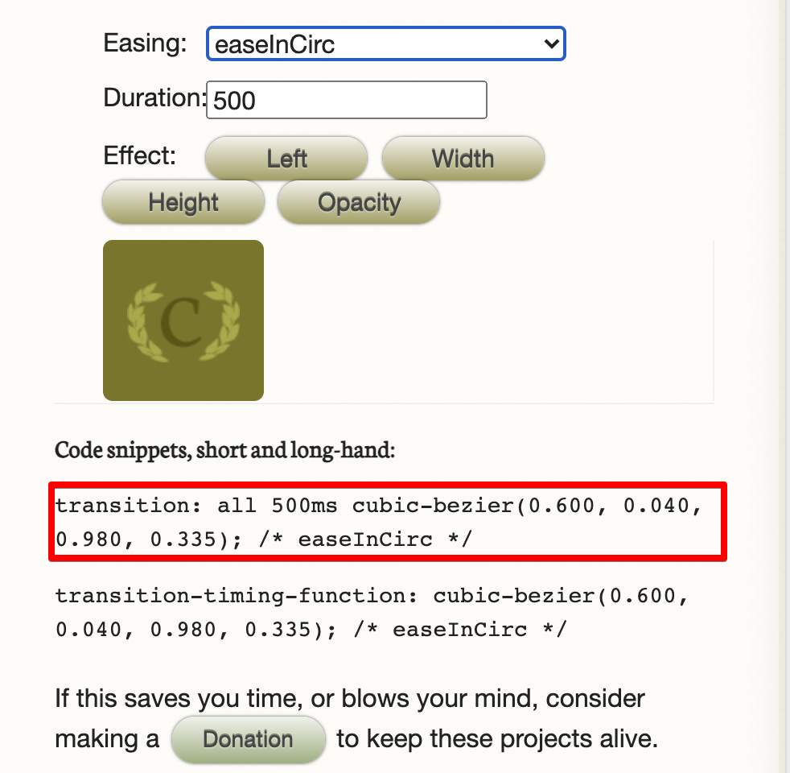

<link href="../md_config/style.css" rel="stylesheet">

# Transition Pt2

- [Website to checkout](https://matthewlein.com/tools/ceaser)

## 1) Ease-in-out

- Has **`cubic-bezier curve`** already set
- This decides how the animations should accelerate and decelerate.
- You can also use cubic-bezier() function to set you own

  

## 2) Select items or use all

- If only one property or you want to change some property, select them.
  - You need to add with (,) using semi-colon.
- Else you can use all to select everything
