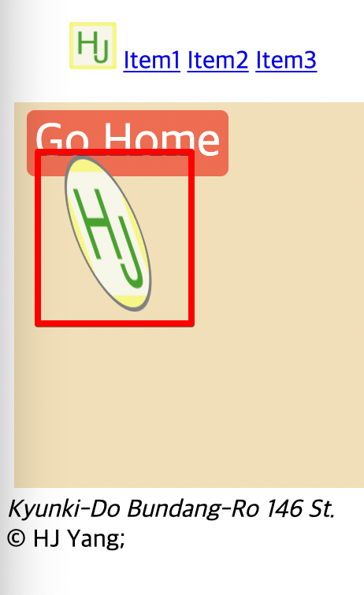

<link href="../md_config/style.css" rel="stylesheet">

# Transfromation

- [You can check out this website](https://developer.mozilla.org/ko/docs/Web/CSS/transform)
- This can alter the element, by adding transformation properties
- Properties
  1. rotateY(70deg) : rotate on Y axis
  2. rotateX(20deg) : rotate on X axis
  3. scaleX(1.2) : scale on X axis
  4. translateY(-20px) : move on Y axis
  5. Skew : Skwing the image

## 1) Transformation - image

- **`This will apply on the pixcels itself`**
- Like the example below, the image covers the button.
- This does not effect the box(or other boxes near it - it doesn't happen in the box level but happens in the pixcel level)  
  **`Don't use this to create margins or paddings!`**  
  Just used to move elements as desired without altering the box.
- Example
  - HTML
    ```HTML
      <section>
        <article>
          <div>
            <a href="#">Go Home</a>
          </div>
          <div>
            
          </div>
        </article>
      </section>
    ```
  - CSS
    ```CSS
      section img {
        margin: 5px;
        height: 100px;
        width: 100px;
        border: 3px solid grey;
        border-radius: 50%;
        transform: rotateY(70deg) rotateX(20deg) scaleX(1.2) translateY(-20px);
      }
    ```
  - Result
    

## 2) Combination with transition

- transition

  1. Syntax  
     **`transition: <what> <time> <method>, [<other transitions>]`**
  2. place transition where there is no state, and place(or Not) transform where state exists.

- Example

  - HTML
    ```HTML
      <section>
        <article>
          <div>
            <a href="#">Go Home</a>
          </div>
          <div>
            
          </div>
        </article>
      </section>
    ```
  - CSS
    ```CSS
      section img {
        margin: 5px;
        height: 100px;
        width: 100px;
        border: 3px solid grey;
        border-radius: 50%;
        transition: transform 1s ease-in-out;
      }
      section img:hover {
        transform: rotateY(70deg) rotateX(20deg) scaleX(1.2) translateY(-20px);
      }
    ```
  - Result
    
