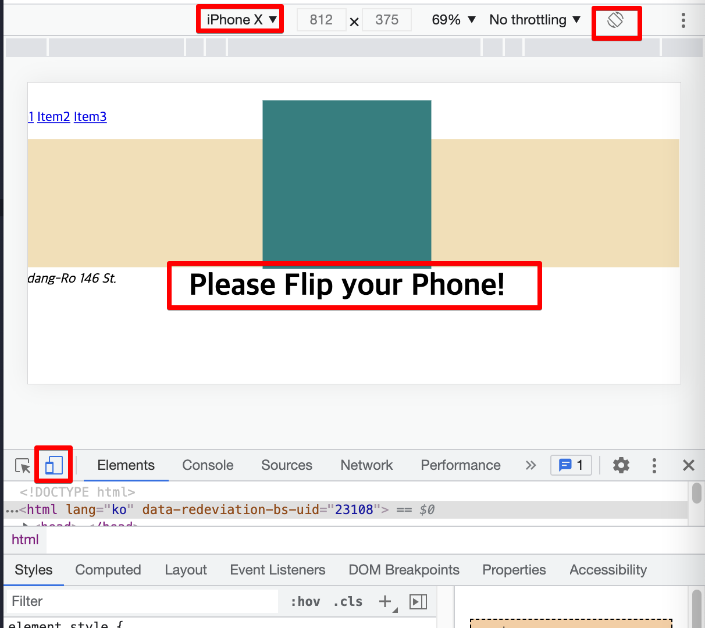
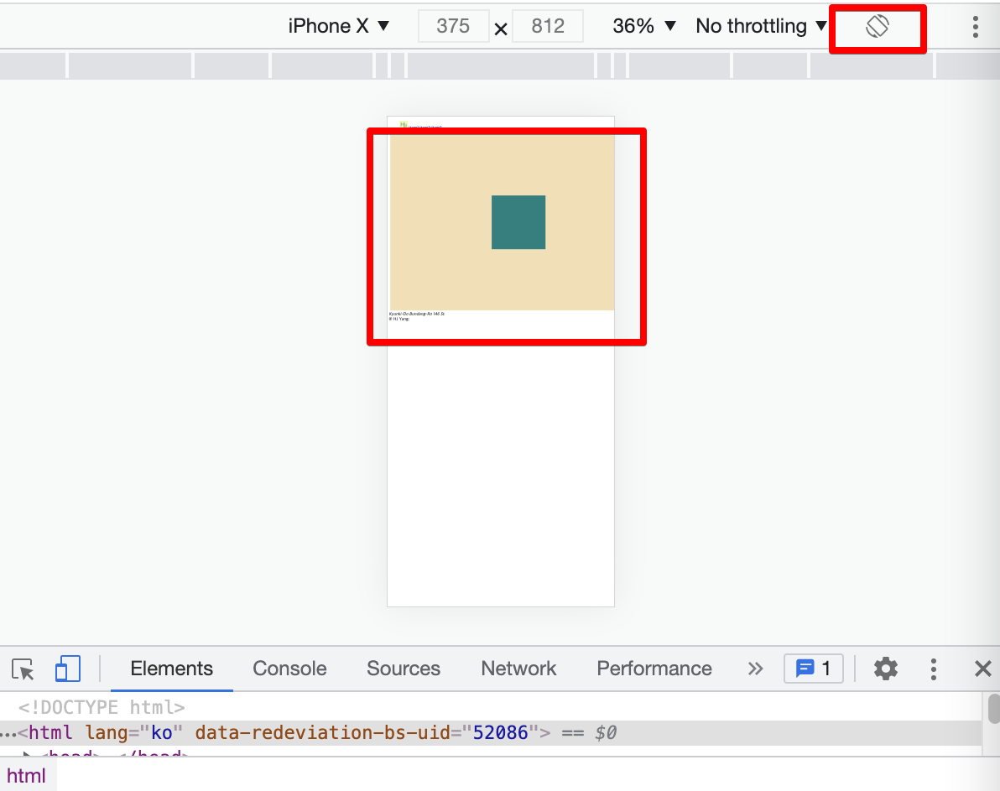

<link href="../md_config/style.css" rel="stylesheet">

# Media Queries

- [Site to look at Media Queries](https://developer.mozilla.org/ko/docs/Web/CSS/Media_Queries/Using_media_queries)
- This is a way to add conditions;  
  If condition is True, do the CSS code under the True condition
- Used with multiple "and", and "@media queries" itself
- Kinds
  1. max width : max condition for True
  2. min width : min condition for True
  3. min/max hegith : min/max condition for height True
  4. min-device-width : Only for phone, min width
  5. max-device-width : Only for phone, max width
  6. orientation : 가로/세로, landscape/portrait mode on moveable devices

## 1) Media Queries

- This is an way to detect screen size by using only CSS.
- This is needed because; User screen always changes
  1. Landscape mode, portrait mode
  2. Phone, PC

<br>s

- You can cascade "and" conditions in the @media query
- You can cascase "@media query" after another

- Example

  - HTML
    ```HTML
      <section>
        <article>
          <div></div>
          <span class="is-landscape">Please Flip your Phone!</span>
        </article>
      </section>
      <aside></aside>
    ```
  - CSS

    ```CSS
      section {
        margin: 5px;
        height: 30vh;
        max-height: 60vh;
        background-color: wheat;
        padding: 8px;

        display: flex;
        justify-content: center;
        align-items: center;
        flex-direction: column;
      }

      section article {
        display: flex;
        justify-content: center;
        align-items: center;
        flex-direction: column;
      }

      section div {
        background-color: teal;
        width: 200px;
        height: 200px;
      }

      span.is-landscape {
        font-weight: bold;
        font-size: 36px;
      }

      @media screen and (min-width: 550px) and (max-width: 660px) {
        section div {
          background-color: tomato;
        }
      }

      @media screen and (orientation: portrait) {
        span {
          display: none;
        }
      }
    ```

  - Result

    1. Landscape  
       

    2. portrait  
       
